# Full Stack Flowchart — HTML → Node → React → Next.js → Redux/RTK

**One visual guide** showing how each technology fits — from **empty folder** to **user sees UI** to **state updates** to **production deploy**.

> Use this before system-design or "explain your stack" interview rounds.

---

<a id="quick-index"></a>

## Quick index

| # | Section |
| --- | --- |
| <span id="i1"></span>1 | [Big picture — all technologies together](#p1) |
| <span id="i2"></span>2 | [From scratch — project setup flow](#p2) |
| <span id="i3"></span>3 | [HTML — where everything starts](#p3) |
| <span id="i4"></span>4 | [Node.js — two roles in the stack](#p4) |
| <span id="i5"></span>5 | [React SPA — full request-to-paint flow](#p5) |
| <span id="i6"></span>6 | [React render cycle (inside the browser)](#p6) |
| <span id="i7"></span>7 | [Next.js — how it extends React](#p7) |
| <span id="i8"></span>8 | [Redux (classic) — data flow](#p8) |
| <span id="i9"></span>9 | [Redux Toolkit (RTK) — simplified flow](#p9) |
| <span id="i10"></span>10 | [End-to-end: user clicks "Add to Cart"](#p10) |
| <span id="i11"></span>11 | [React SPA vs Next.js — side by side](#p11) |
| <span id="i12"></span>12 | [Production deploy flow](#p12) |
| <span id="i13"></span>13 | [Interview answer — explain the stack in 60 seconds](#p13) |

---

<a id="p1"></a>

## 1. Big picture — all technologies together

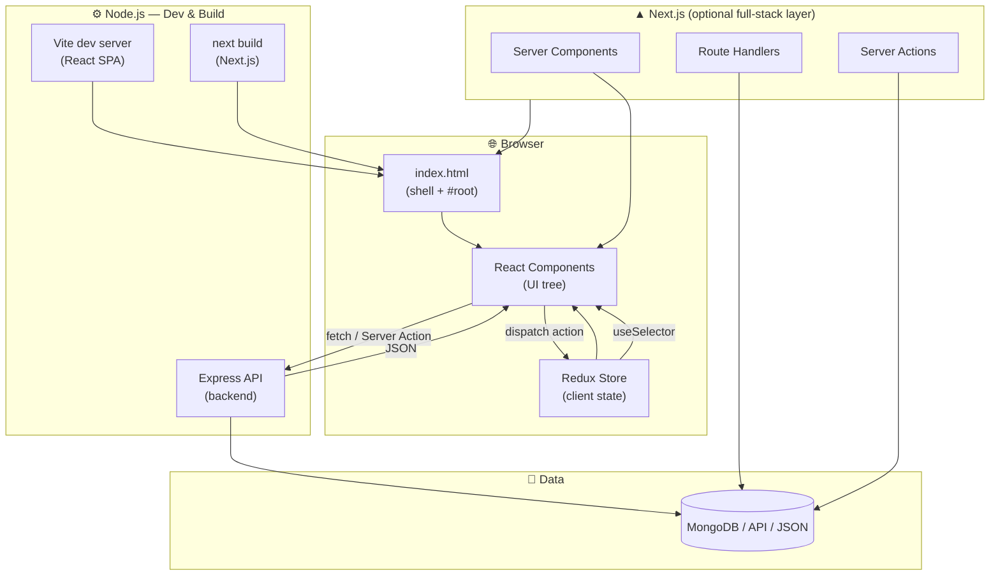

### Who does what?

| Technology | Role in stack |
|------------|---------------|
| **HTML** | Page shell — `<div id="root">`, meta, initial document |
| **Node.js** | JS runtime for Vite, Next.js server, Express API, `npm` tooling |
| **React** | UI library — components, hooks, virtual DOM, client interactivity |
| **Next.js** | React **framework** — routing, SSR, RSC, Server Actions, deploy |
| **Redux** | Predictable **client state container** — actions → reducer → store |
| **Redux Toolkit** | Official Redux API — `createSlice`, Immer, less boilerplate |

---


<p><a href="#i1">Back to index</a></p>

<a id="p2"></a>

## 2. From scratch — project setup flow

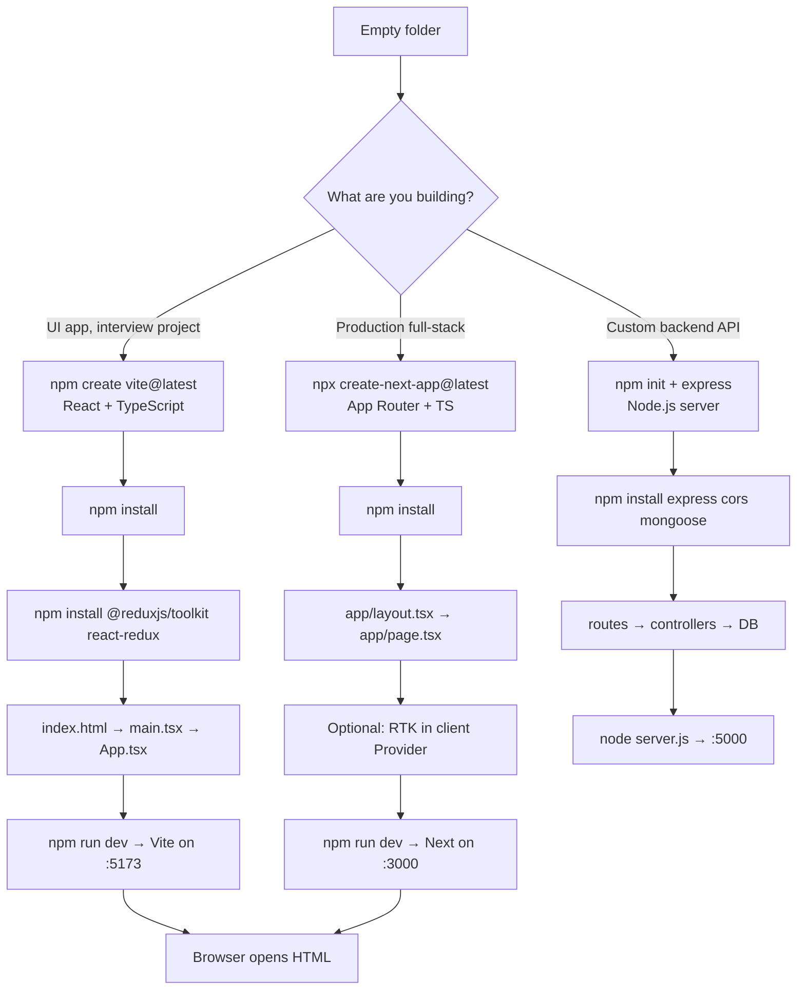

### File birth order — React SPA (Vite)

```text
1. index.html          ← browser entry (HTML)
2. src/main.tsx        ← React mounts here
3. src/App.tsx         ← root component
4. src/lib/store/      ← Redux Toolkit store
5. src/components/     ← UI
6. vite.config.ts      ← Node-powered dev server config
7. package.json        ← scripts: dev, build, preview
```

### File birth order — Next.js

```text
1. app/layout.tsx      ← root layout (Server Component)
2. app/page.tsx        ← home route
3. app/globals.css     ← styles
4. next.config.ts      ← framework config
5. components/providers/ ← RTK Provider ("use client")
6. app/api/ or route.ts ← backend endpoints (optional)
```

---


<p><a href="#i2">Back to index</a></p>

<a id="p3"></a>

## 3. HTML — where everything starts

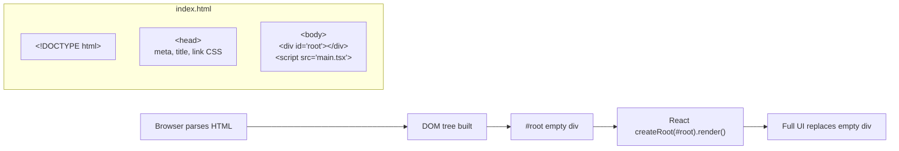

### Minimal HTML (React SPA)

```html
<!DOCTYPE html>
<html lang="en">
  <head>
    <meta charset="UTF-8" />
    <meta name="viewport" content="width=device-width, initial-scale=1.0" />
    <title>CartPulse</title>
  </head>
  <body>
    <!-- React mounts here — HTML is just the shell -->
    <div id="root"></div>
    <script type="module" src="/src/main.tsx"></script>
  </body>
</html>
```

### HTML vs React vs Next.js

| | Plain HTML | React SPA | Next.js |
|---|------------|-----------|---------|
| Content | Static in HTML file | JS builds DOM in `#root` | Server sends HTML + hydrates |
| Navigation | Full page reload | Client router (no reload) | Client + server routing |
| SEO | Manual | Poor unless SSR | Built-in SSR/RSC |

**Interview line:** HTML is the document shell; React fills `#root`; Next.js can pre-fill HTML on the server before React hydrates.

---


<p><a href="#i3">Back to index</a></p>

<a id="p4"></a>

## 4. Node.js — two roles in the stack

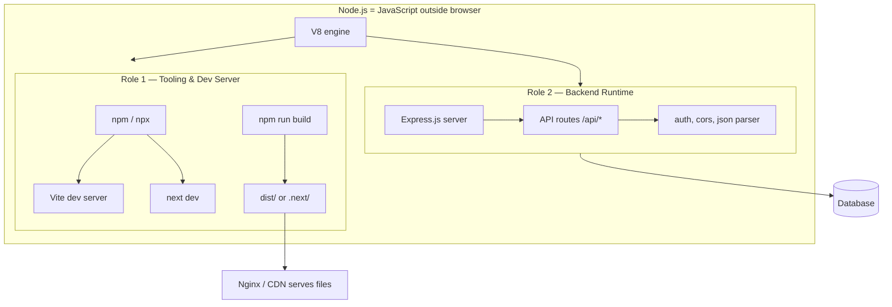

### Node.js in one sentence each

| Use | Example |
|-----|---------|
| Run dev server | `vite` transforms TSX → JS on the fly |
| Build for prod | `vite build` bundles React app to `dist/` |
| Run API | `express()` listens on port 5000 |
| Run Next server | `next start` serves SSR + API routes |

**Interview line:** Node runs JavaScript on the server — both your **build tools** (Vite, Next) and your **API** (Express) depend on it.

---


<p><a href="#i4">Back to index</a></p>

<a id="p5"></a>

## 5. React SPA — full request-to-paint flow

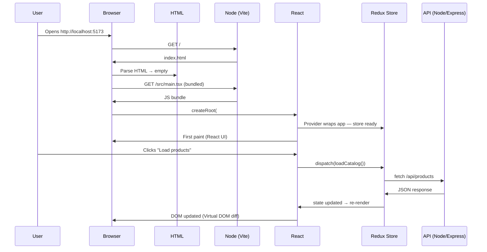

### Bootstrap code (matches this repo's Projects)

```tsx
// main.tsx — entry: HTML → React → Redux → Router
createRoot(document.getElementById('root')!).render(
  <StrictMode>
    <StoreProvider>        {/* Redux */}
      <BrowserRouter>      {/* Routing */}
        <App />            {/* Component tree */}
      </BrowserRouter>
    </StoreProvider>
  </StrictMode>,
)
```

---


<p><a href="#i5">Back to index</a></p>

<a id="p6"></a>

## 6. React render cycle (inside the browser)

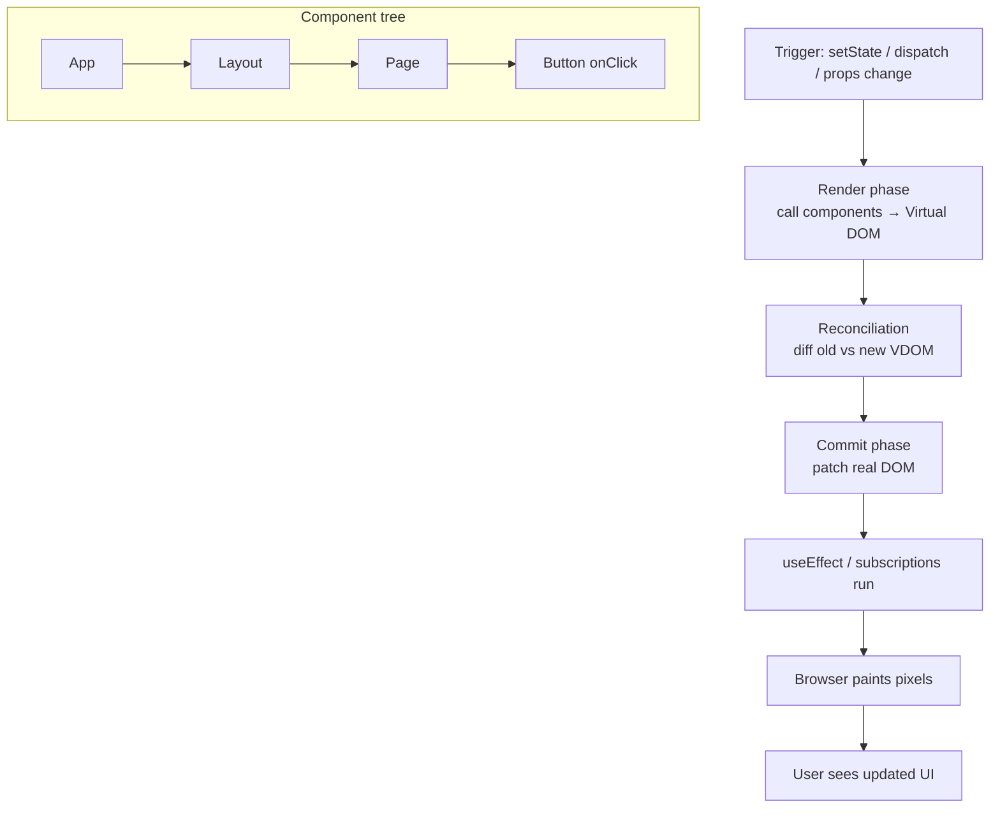

| Phase | What happens |
|-------|--------------|
| **Render** | Functions run, JSX → virtual DOM tree |
| **Reconcile** | React diffs trees, finds minimal changes |
| **Commit** | Apply changes to real DOM |
| **Effects** | Side effects after paint (`useEffect`) |

---


<p><a href="#i6">Back to index</a></p>

<a id="p7"></a>

## 7. Next.js — how it extends React

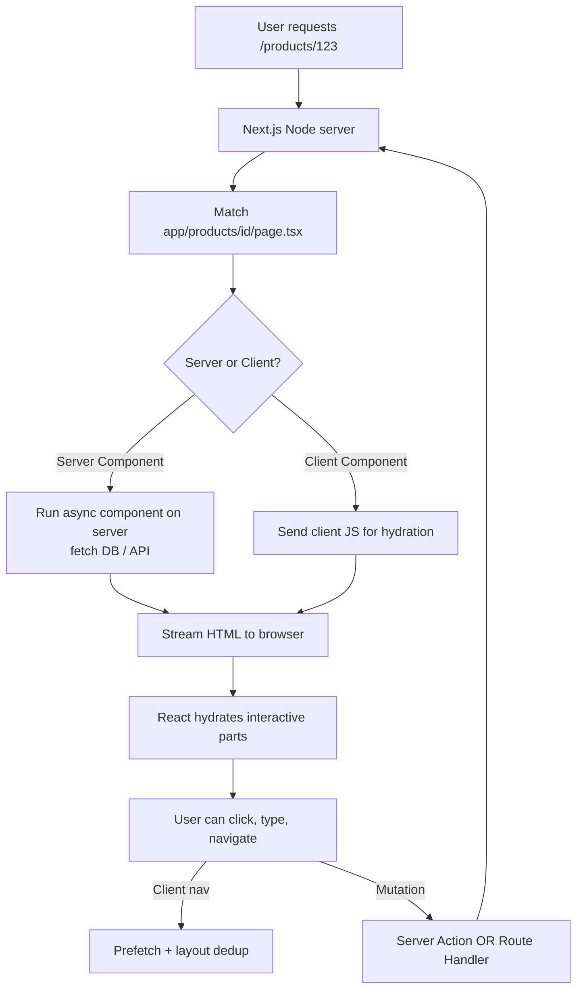

### Next.js adds on top of React

```text
React alone     = UI library (components, hooks)
Next.js         = React + file routing + SSR/RSC + API layer + deploy
```

| Feature | Plain React (Vite) | Next.js |
|---------|-------------------|---------|
| Routing | react-router (client) | `app/` file-based |
| First HTML | Empty `#root` | Server-rendered content |
| Data fetch | `useEffect` / RTK thunk | Server Component `await` |
| API | Separate Express server | Route Handlers + Server Actions |
| Redux | Optional in Provider | Optional in client layout |

**Interview line:** Next.js is React with a server — routes are files, data can fetch before HTML ships, and mutations can use Server Actions instead of a separate REST layer.

---


<p><a href="#i7">Back to index</a></p>

<a id="p8"></a>

## 8. Redux (classic) — data flow

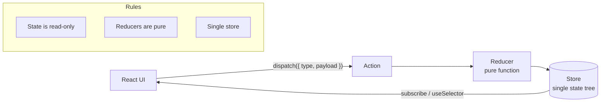

### Classic Redux steps (verbose — know for interviews)

```text
1. UI:     store.dispatch({ type: 'cart/addItem', payload: { id: 1 } })
2. Store:  forwards action to reducer
3. Reducer: (state, action) => newState   ← must be pure, no mutate
4. Store:  saves newState
5. UI:     useSelector re-runs → component re-renders
```

### Classic boilerplate (why RTK exists)

```javascript
// Action type + creator
const ADD = 'cart/add';
const addItem = (id) => ({ type: ADD, payload: id });

// Reducer — manual immutable updates
function cartReducer(state = [], action) {
  switch (action.type) {
    case ADD:
      return [...state, action.payload];
    default:
      return state;
  }
}

// Store
const store = createStore(cartReducer);
```

---


<p><a href="#i8">Back to index</a></p>

<a id="p9"></a>

## 9. Redux Toolkit (RTK) — simplified flow

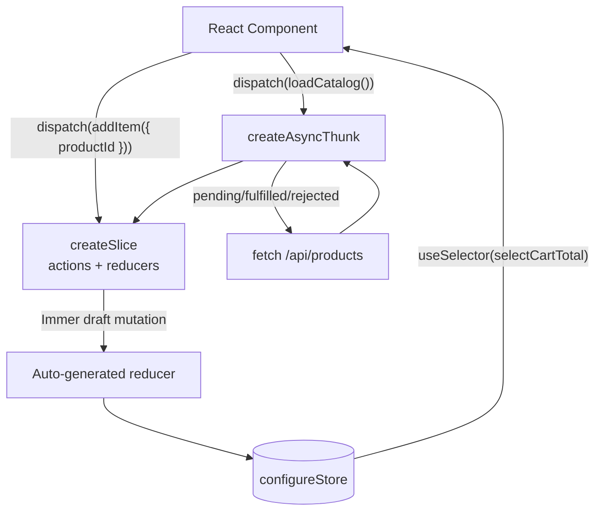

### RTK in this repo (CartPulse pattern)

```text
cartSlice.ts
├── createSlice({ name, initialState, reducers })
│   ├── addItem      → sync reducer (Immer — "mutate" draft safely)
│   ├── removeItem
│   └── setQuantity
├── createAsyncThunk('cart/loadCatalog')
│   └── fetchProducts → API call
└── extraReducers → handle pending/fulfilled/rejected

store/index.ts
└── configureStore({ reducer: { cart: cartReducer } })

StoreProvider.tsx
└── <Provider store={store}>

Component
├── useDispatch() → dispatch(addItem({ productId }))
└── useSelector(selectCartTotal) → derived data
```

### Redux vs Redux Toolkit

| | Classic Redux | Redux Toolkit |
|---|---------------|---------------|
| Actions | Manual strings + creators | Auto-generated from slice |
| Reducer | Switch + spread manually | Immer — write "mutating" logic |
| Store | `createStore` + middleware setup | `configureStore` — defaults included |
| Async | Manual thunk boilerplate | `createAsyncThunk` built-in |
| When | Legacy codebases | **New projects (default)** |

**Interview line:** RTK is the official way to write Redux — `createSlice` generates actions and reducers, Immer handles immutability, and `configureStore` sets up DevTools and thunk middleware automatically.

---


<p><a href="#i9">Back to index</a></p>

<a id="p10"></a>

## 10. End-to-end: user clicks "Add to Cart"

Full flow across **HTML → React → RTK → API → DOM**:

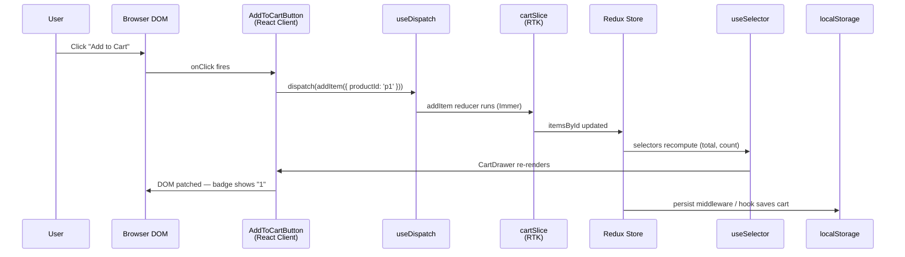

### Code path (simplified)

```tsx
// 1. Button (React)
<button onClick={() => dispatch(addItem({ productId: 'p1' }))}>
  Add to Cart
</button>

// 2. Slice (RTK)
addItem(state, action) {
  const { productId } = action.payload
  // Immer — safe "mutation"
  state.itemsById[key] = { productId, quantity: 1 }
}

// 3. Selector (memoized)
export const selectCartCount = (state) =>
  Object.values(state.cart.itemsById).reduce((n, l) => n + l.quantity, 0)

// 4. UI reads store
const count = useSelector(selectCartCount)  // → re-render when count changes
```

---


<p><a href="#i10">Back to index</a></p>

<a id="p11"></a>

## 11. React SPA vs Next.js — side by side

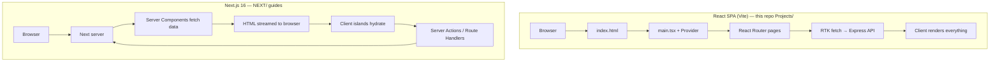

| Step | React + Vite + RTK | Next.js 16 |
|------|-------------------|------------|
| Entry | `index.html` → `main.tsx` | `app/layout.tsx` |
| Routing | `react-router` | File `app/page.tsx` |
| Data | RTK `createAsyncThunk` + fetch | Server Component `await` |
| State | Redux client store | Redux optional + server cache |
| API | Express on Node :5000 | Route Handlers / Server Actions |
| Deploy | `dist/` → Nginx | Vercel / `standalone` Docker |

---


<p><a href="#i11">Back to index</a></p>

<a id="p12"></a>

## 12. Production deploy flow

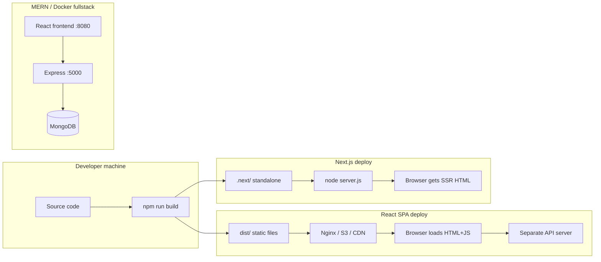

### Deploy commands (this repo)

```bash
# React SPA
cd Projects/09-shopping-cart && npm run build   # → dist/

# Next.js
cd my-next-app && npm run build && npm start    # standalone

# Fullstack Docker
cd Docker/fullstack && docker compose up --build
# Browser :8080 → Nginx → React
# API     :5000 → Express → health check
```

---


<p><a href="#i12">Back to index</a></p>

<a id="p13"></a>

## 13. Interview answer — explain the stack in 60 seconds

> **HTML** is the document shell with a root div. **Node.js** runs the dev server, build tools, and optionally an Express API. **React** mounts into that root, builds a component tree, and updates the DOM through a virtual DOM diff. When client state is shared across many components — like a cart — I use **Redux Toolkit**: components dispatch actions, slices update the store with Immer, and selectors feed data back to the UI. **Next.js** is the full-stack layer on top of React — file-based routes, server components that fetch before HTML ships, and Server Actions for mutations. In this repo's Projects I use Vite + React + RTK; for production full-stack I'd reach for Next.js or React + Express with the same RTK patterns on the client.

---

## Quick reference diagram (print this)

```text
┌─────────────────────────────────────────────────────────────────┐
│                         BROWSER                                  │
│  HTML (shell) → React (UI) ←→ Redux/RTK (client state)          │
│       ↑              ↓ dispatch / selector                       │
└───────┼──────────────┼──────────────────────────────────────────┘
        │              │ fetch / Server Action
        │              ↓
┌───────┼──────────────┼──────────────────────────────────────────┐
│       │         NODE.JS                                        │
│  Vite / Next dev & build    │    Express API (optional)        │
│  next start (SSR)           │    /api/products → MongoDB       │
└─────────────────────────────────────────────────────────────────┘

Next.js path:  Request → Next server → RSC fetch → HTML stream → hydrate
React SPA path: Request → index.html → JS bundle → RTK → API → render
```

---

*Related: [Projects/09-shopping-cart/ARCHITECTURE.md](../Projects/09-shopping-cart/ARCHITECTURE.md) · [react-at-a-glance.md](./react-at-a-glance.md) · [nextjs-at-a-glance.md](./nextjs-at-a-glance.md) · [Docker/fullstack/](../Docker/fullstack/)*


<p><a href="#i13">Back to index</a></p>
