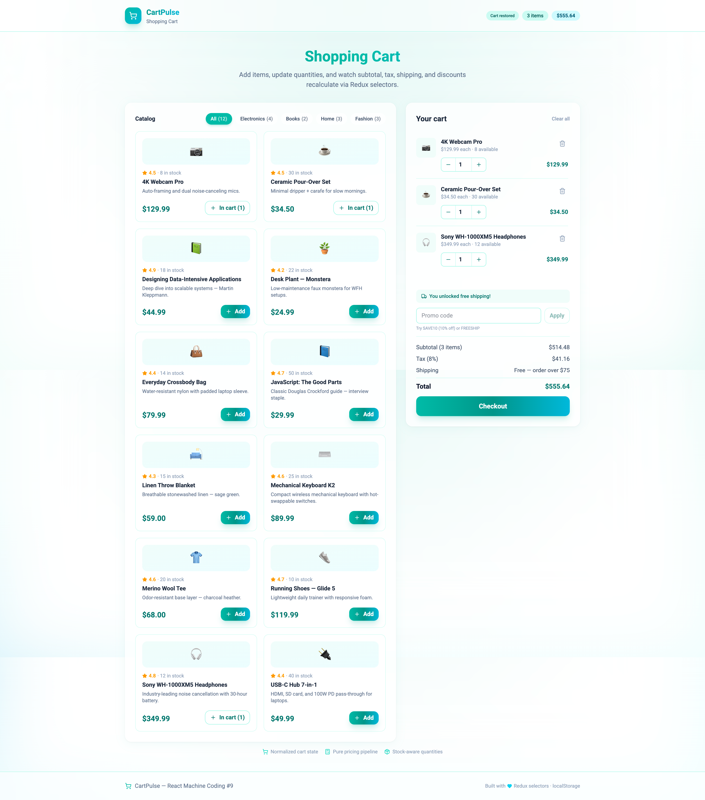

# Interview Preparation

**Personal frontend & full-stack interview prep repository** — runnable React machine-coding apps, **vanilla JS projects**, markdown Q&A guides (React, Vue, **CSS**, Docker), and system design notes. Built to **run code locally**, **read architecture**, and **practice spoken interview answers**.



---

## What This Repo Contains

| Section                     | Description                                                              | Folder                                                               |
| --------------------------- | ------------------------------------------------------------------------ | -------------------------------------------------------------------- |
| **Machine coding projects** | 10 complete React apps with README, architecture docs, and interview Q&A | [Projects/](./Projects/)                                             |
| **Vanilla JS projects**     | 4 framework-free apps — store, CRUD, performance, component kit          | [Projects/vanilla-js/](./Projects/vanilla-js/)                       |
| **React interviews**        | Fundamentals, senior topics, company-specific rounds, Next.js            | [React/](./React/)                                                   |
| **Vue interviews**          | Vue 3, Pinia, Router, Nuxt, live coding                                  | [Vue/](./Vue/)                                                       |
| **CSS interviews**          | Mid/senior layout, specificity, Tailwind, performance, a11y              | [css/](./css/)                                                       |
| **MERN stack**              | MongoDB, Express, React, Node, JWT, deployment                           | [MERN/](./MERN/)                                                     |
| **Docker**                  | Interview Q&A + Dockerfile / Compose for React, Vue, Next, Nuxt, Node    | [Docker/](./Docker/)                                                 |
| **JavaScript**              | Vanilla JS rounds, HOF/array/string/object core, LeetCode helpers        | [Javascript/](./Javascript/) · [vanila-js/](./Javascript/vanila-js/) |
| **System design**           | Scalability, core components, design process, file upload case           | [System Design/](./System%20Design/)                                 |
| **Architecture diagrams**   | CDN, load balancer, caching, sharding, microservices                     | [Advanced Topic Images/](./Advanced%20Topic%20Images/)               |

---

## Machine Coding Projects (10)

Hands-on **React** UI challenges — each folder has **`README.md`**, **`ARCHITECTURE.md`**, and **`INTERVIEW-QUESTIONS.md`**.

| #   | Codename       | What it teaches                                            | Folder                                                         |
| --- | -------------- | ---------------------------------------------------------- | -------------------------------------------------------------- |
| 1   | **QueryLens**  | Debounce, keyboard nav, ARIA combobox                      | [01-autocomplete-search](./Projects/01-autocomplete-search/)   |
| 2   | **FlowFeed**   | Infinite scroll, Intersection Observer                     | [02-infinite-scroll-feed](./Projects/02-infinite-scroll-feed/) |
| 3   | **TreeScope**  | Recursive tree, expand/collapse                            | [03-file-explorer](./Projects/03-file-explorer/)               |
| 4   | **FlowBoard**  | Drag & drop, normalized kanban state                       | [04-kanban-board](./Projects/04-kanban-board/)                 |
| 5   | **GridLens**   | Sort, filter, search, pagination pipeline                  | [05-data-table](./Projects/05-data-table/)                     |
| 6   | **FormFlow**   | Multi-step form, RHF + Zod, persistence                    | [06-multi-step-form](./Projects/06-multi-step-form/)           |
| 7   | **LayerForge** | Modal stack, focus trap, Escape key                        | [07-modal-manager](./Projects/07-modal-manager/)               |
| 8   | **ThreadNest** | Nested comments, immutable tree updates                    | [08-nested-comments](./Projects/08-nested-comments/)           |
| 9   | **CartPulse**  | Shopping cart, advanced catalog, Redux selectors, variants | [09-shopping-cart](./Projects/09-shopping-cart/)               |
| 10  | **ToastForge** | Toast queue, auto-dismiss, pause-on-hover                  | [10-toast-notifications](./Projects/10-toast-notifications/)   |

Full series overview: [Projects/README.md](./Projects/README.md)

---

## Vanilla JS Projects (4)

Framework-free **HTML + JavaScript** apps that mirror senior React/Next.js skills — custom store, routing, CRUD, and performance patterns. Projects **02–04** use **Tailwind CSS v4**.

| #   | Folder                    | What it teaches                                           |
| --- | ------------------------- | --------------------------------------------------------- |
| 1   | `01-ui-component-kit`     | Design tokens, Button, Modal, Toast Web Component, a11y   |
| 2   | `02-catalog-spa`          | Pub/sub store, hash router, cart, Fetch API, SEO metadata |
| 3   | `03-performance-patterns` | 10k-row virtual scroll, debounce, lazy images, Vitals     |
| 4   | `04-data-table`           | Full CRUD employee table, filters, pagination, `<dialog>` |

Overview + job-requirement mapping: [Projects/vanilla-js/README.md](./Projects/vanilla-js/README.md)

```bash
cd Projects/vanilla-js/04-data-table   # or any vanilla-js subfolder
npm install
npm run dev
npm test
```

**Pair with React:** Compare `vanilla-js/04-data-table` with React [05-data-table](./Projects/05-data-table/) — same query pipeline, different rendering layer.

---

## Tech Stack

### React projects (`Projects/01`–`10`)

| Layer       | Technology                                                                   |
| ----------- | ---------------------------------------------------------------------------- |
| Runtime     | Node.js **24.11.0**                                                          |
| Build       | Vite 7                                                                       |
| UI          | React 19, TypeScript                                                         |
| Styling     | Tailwind CSS 4 — per-project themes (Soft Glass Aurora, Commerce Jade, etc.) |
| State       | Redux Toolkit + memoized selectors                                           |
| Motion      | Framer Motion                                                                |
| Forms       | react-hook-form + Zod (Project #6)                                           |
| Drag & drop | @dnd-kit (Project #4)                                                        |

### Vanilla JS projects (`Projects/vanilla-js`)

| Layer   | Technology                                    |
| ------- | --------------------------------------------- |
| Build   | Vite 7 + Vitest + happy-dom                   |
| Styling | Tailwind CSS v4 (02–04) · CSS variables (01)  |
| State   | Custom `createStore()` (Redux-shaped pub/sub) |
| Routing | Hash router (catalog-spa)                     |
| Persist | `localStorage` (cart, CRUD mutations)         |

---

## Getting Started

**Prerequisites:** Node.js **24.11.0** (or **20.11+** for vanilla-js), npm

### Run a React machine coding project

```bash
cd Projects/01-autocomplete-search
npm install
npm run dev
```

Open [http://localhost:5173](http://localhost:5173)

Then read that project's docs in order:

1. `README.md` — features and scripts
2. `ARCHITECTURE.md` — data flow and state shape
3. `INTERVIEW-QUESTIONS.md` — practice answers aloud

### Run CartPulse (advanced catalog + cart)

```bash
cd Projects/09-shopping-cart
npm install
npm run dev
```

Routes: `/` (demo cart), `/catalog` (filters + floating cart drawer), `/products/:id` (detail + variants).  
Try promo codes **`SAVE10`** and **`FREESHIP`** — cart persists in `localStorage` after refresh.

### Run a vanilla JS project

```bash
cd Projects/vanilla-js/02-catalog-spa
npm install
npm run dev
```

### Docker (optional)

```bash
# Fullstack: React frontend + Express API
cd Docker/fullstack
docker compose up --build -d

curl http://localhost:5000/api/health
open http://localhost:8080
```

More templates: [Docker/README.md](./Docker/README.md)

---

## Repo Structure

```
Interview-Preparation/
├── README.md                 ← you are here
├── Projects/
│   ├── 01-autocomplete-search … 10-toast-notifications   ← React apps
│   └── vanilla-js/             ← 4 vanilla JS apps
├── css/                        ← Mid/senior CSS interview Q&A
├── React/                      ← React / Next.js interview guides
├── Vue/                        ← Vue / Nuxt interview guides
├── MERN/                       ← MongoDB, Express, Node, full-stack
├── Docker/                     ← Docker Q&A + compose templates
├── Javascript/                 ← JS patterns + coding rounds
├── System Design/              ← System design fundamentals
└── Advanced Topic Images/      ← Architecture PNG diagrams
```

---

## How to Use This Repo

| Goal                          | Where to go                                                                                                                          |
| ----------------------------- | ------------------------------------------------------------------------------------------------------------------------------------ |
| Practice live coding          | [Projects/](./Projects/) — run app, explain code without reading                                                                     |
| Prove framework fundamentals  | [Projects/vanilla-js/](./Projects/vanilla-js/) — store, DOM, performance without React                                               |
| JS core: HOF, arrays, objects | [Javascript/vanila-js/](./Javascript/vanila-js/) — implement `map`/`reduce`, immutability, grouping                                  |
| JS coding & DSA (Top 30)      | [Javascript/vanila-js/08-top-30-javascript-interview-problems.md](./Javascript/vanila-js/08-top-30-javascript-interview-problems.md) |
| State management deep dive    | [Projects/09-shopping-cart/](./Projects/09-shopping-cart/)                                                                           |
| Data table + CRUD             | React [05-data-table](./Projects/05-data-table/) · Vanilla [04-data-table](./Projects/vanilla-js/04-data-table/)                     |
| CSS / layout interview        | [css/01-senior-mid-level-css-interview-questions.md](./css/01-senior-mid-level-css-interview-questions.md)                           |
| Quick React theory refresh    | [React/12-react-top-30-interview-qa.md](./React/12-react-top-30-interview-qa.md)                                                     |
| Full-stack / backend          | [MERN/](./MERN/) + [Docker/fullstack/](./Docker/fullstack/)                                                                          |
| System design round           | [System Design/](./System%20Design/) + diagram PNGs                                                                                  |
| Company-specific prep         | [React/](./React/) — KPMG, Blinkit, Capgemini, etc.                                                                                  |

---

## Study Path

1. **Week 1** — React Projects #1–#3 + vanilla `03-performance-patterns` (debounce, scroll, recursion)
2. **Week 2** — React Projects #4–#6 + vanilla `04-data-table` (DnD, data pipeline, CRUD)
3. **Week 3** — React Projects #7–#10 + vanilla `01-ui-component-kit` & `02-catalog-spa` + [MERN/](./MERN/)
4. **Interview week** — Re-read each project's `INTERVIEW-QUESTIONS.md` senior sections; skim [CSS guide](./css/01-senior-mid-level-css-interview-questions.md) and [React top 50](./React/17-top-50-react-interview-questions.md)

---

## Interview Q&A Format (Projects)

Each `INTERVIEW-QUESTIONS.md` includes:

| Section                    | Purpose                                                |
| -------------------------- | ------------------------------------------------------ |
| Fundamentals               | Core concepts tied to the code                         |
| What Interviewers Look For | 5 criteria + strong signal line                        |
| Senior-Level Variations    | Virtualization, optimistic UI, undo, a11y, performance |
| **Interview Answer**       | Spoken one-liner for live rounds                       |
| **Example**                | Concrete scenario to remember                          |

---

## Docs Quick Links

- [Projects/README.md](./Projects/README.md) — all 10 React projects
- [Projects/vanilla-js/README.md](./Projects/vanilla-js/README.md) — 4 vanilla JS projects
- [Projects/09-shopping-cart/README.md](./Projects/09-shopping-cart/README.md) — cart, catalog, pricing, promo codes
- [Projects/09-shopping-cart/INTERVIEW-QUESTIONS.md](./Projects/09-shopping-cart/INTERVIEW-QUESTIONS.md) — richest Redux Q&A
- [css/01-senior-mid-level-css-interview-questions.md](./css/01-senior-mid-level-css-interview-questions.md) — 26 CSS topics with examples
- [Javascript/vanila-js/README.md](./Javascript/vanila-js/README.md) — HOF, arrays, strings, objects, built-ins
- [Javascript/vanila-js/08-top-30-javascript-interview-problems.md](./Javascript/vanila-js/08-top-30-javascript-interview-problems.md) — 30 common coding problems
- [Javascript/vanila-js/07-sorting-stack-queue.md](./Javascript/vanila-js/07-sorting-stack-queue.md) — sorting, stack, queue
- [Javascript/vanila-js/INTERVIEW-QUESTIONS.md](./Javascript/vanila-js/INTERVIEW-QUESTIONS.md) — 63 JS interview Q&A
- [Docker/README.md](./Docker/README.md) — Docker interview + templates
- [MERN/README.md](./MERN/README.md) — full-stack MERN Q&A
- [System Design/README.md](./System%20Design/README.md) — system design path

---

_Start with [Projects/01-autocomplete-search/](./Projects/01-autocomplete-search/), [Projects/vanilla-js/02-catalog-spa/](./Projects/vanilla-js/02-catalog-spa/), or [Projects/09-shopping-cart/](./Projects/09-shopping-cart/) for state management._
