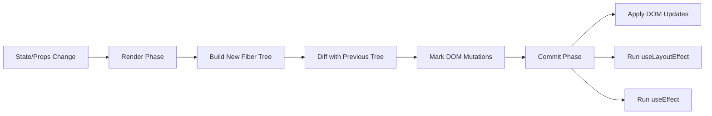
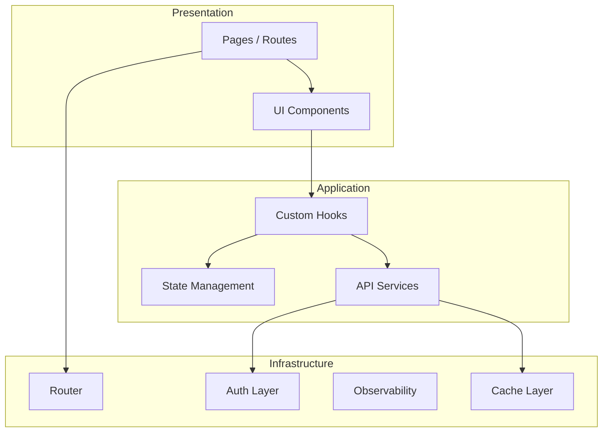
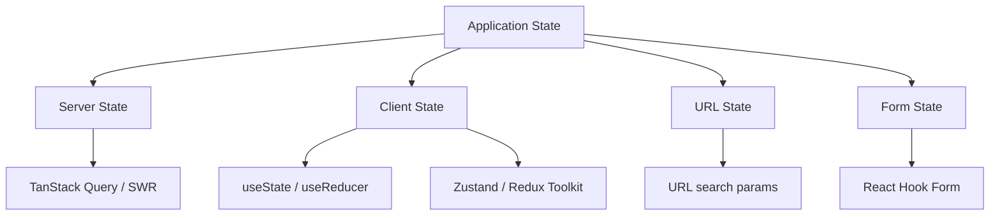
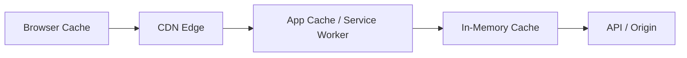
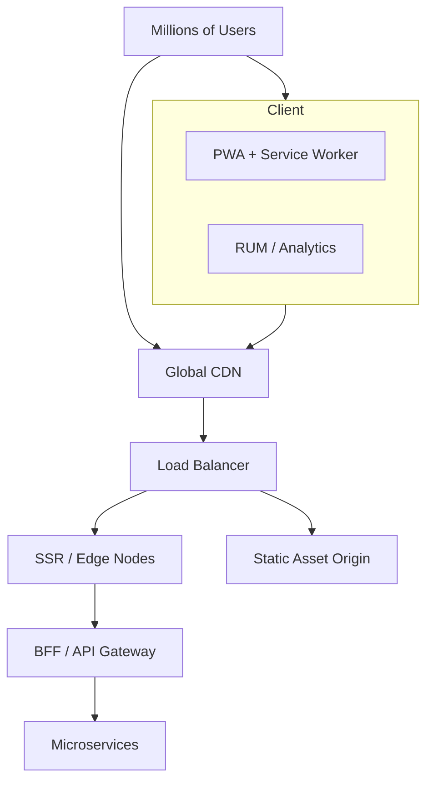

# Zomato Frontend Engineer Interview Preparation (4+ YOE)

This guide covers questions commonly asked in senior frontend interviews — with **theory**, **practical code**, **architecture thinking**, and **how to frame behavioral answers**.

---

## Table of Contents

- [Round 1 — Technical](#round-1--technical)
- [Round 2 — Advanced Technical / System Design](#round-2--advanced-technical--system-design)
- [Round 3 — Managerial / Behavioral](#round-3--managerial--behavioral)
- [Quick Revision Cheat Sheet](#quick-revision-cheat-sheet)

---

# Round 1 — Technical

## 1. What is the difference between `var`, `let`, and `const`?

### Theory

| Feature                | `var`                               | `let`                                | `const`                              |
| ---------------------- | ----------------------------------- | ------------------------------------ | ------------------------------------ |
| Scope                  | Function-scoped                     | Block-scoped                         | Block-scoped                         |
| Hoisting               | Hoisted, initialized as `undefined` | Hoisted but in TDZ until declaration | Hoisted but in TDZ until declaration |
| Reassignment           | Allowed                             | Allowed                              | Not allowed (binding is constant)    |
| Redeclaration          | Allowed in same scope               | Not allowed                          | Not allowed                          |
| Global object property | `window.x` in browsers              | No                                   | No                                   |

**TDZ (Temporal Dead Zone):** The period between entering a scope and the line where `let`/`const` is declared. Accessing the variable in TDZ throws `ReferenceError`.

**Important nuance for `const`:** `const` prevents **rebinding**, not **mutation**. Objects and arrays can still be mutated.

### Practical Example

```javascript
// --- Scope ---
function scopeDemo() {
  if (true) {
    var a = 1; // function-scoped
    let b = 2; // block-scoped
    const c = 3; // block-scoped
  }
  console.log(a); // 1
  // console.log(b); // ReferenceError
  // console.log(c); // ReferenceError
}

// --- Hoisting ---
console.log(x); // undefined (var is hoisted)
var x = 10;

// console.log(y); // ReferenceError (TDZ)
let y = 20;

// --- const mutation vs reassignment ---
const user = { name: "Rahul" };
user.name = "Amit"; // ✅ OK — mutating object
// user = {};       // ❌ TypeError — rebinding

// --- Classic var loop bug ---
for (var i = 0; i < 3; i++) {
  setTimeout(() => console.log(i), 100); // 3, 3, 3
}

for (let j = 0; j < 3; j++) {
  setTimeout(() => console.log(j), 100); // 0, 1, 2
}
```

### Interview Answer (concise)

> Use `const` by default, `let` when reassignment is needed, and avoid `var` in modern code. `let`/`const` give block scope and prevent hoisting bugs. `const` ensures the reference doesn't change, which makes code easier to reason about in large codebases.

---

## 2. Explain closures with a practical example

### Theory

A **closure** is when a function **remembers and accesses variables from its lexical scope** even after the outer function has finished executing.

Closures enable:

- Data privacy / encapsulation
- Factory functions
- Memoization
- Event handlers with preserved state
- Module pattern

**Memory consideration:** Closures hold references to outer variables. Holding large objects in closures can cause memory leaks if not cleaned up.

### Practical Example — Counter Module

```javascript
function createCounter(initial = 0) {
  let count = initial; // private state

  return {
    increment() {
      count++;
    },
    decrement() {
      count--;
    },
    getCount() {
      return count;
    },
  };
}

const counter = createCounter(10);
counter.increment();
console.log(counter.getCount()); // 11
// count is NOT accessible directly — encapsulated via closure
```

### Practical Example — Memoization (common in interviews)

```javascript
function memoize(fn) {
  const cache = new Map(); // closed over by returned function

  return function (...args) {
    const key = JSON.stringify(args);
    if (cache.has(key)) return cache.get(key);

    const result = fn(...args);
    cache.set(key, result);
    return result;
  };
}

const expensiveSum = memoize((a, b) => {
  console.log("Computing...");
  return a + b;
});

expensiveSum(2, 3); // Computing... → 5
expensiveSum(2, 3); // 5 (cached, no log)
```

### Practical Example — React-style debounce

```javascript
function debounce(fn, delay) {
  let timerId; // closure holds timer reference

  return function (...args) {
    clearTimeout(timerId);
    timerId = setTimeout(() => fn.apply(this, args), delay);
  };
}

const handleSearch = debounce((query) => {
  console.log("API call:", query);
}, 300);
```

### Interview Answer (concise)

> A closure is a function plus its surrounding lexical environment. The inner function retains access to outer variables after the outer function returns. I use closures for encapsulation, debouncing, memoization, and custom hooks in React.

---

## 3. Build a custom React hook for data fetching

### Theory

A custom hook extracts reusable stateful logic. For data fetching, handle:

- **Loading**, **error**, and **data** states
- **Race conditions** (stale responses)
- **Abort/cleanup** on unmount or dependency change
- Optional: **caching**, **retry**, **refetch**

### Practical Example — Production-grade `useFetch`

```tsx
import { useEffect, useReducer, useRef } from "react";

type FetchState<T> = {
  data: T | null;
  error: Error | null;
  isLoading: boolean;
};

type Action<T> =
  | { type: "loading" }
  | { type: "success"; payload: T }
  | { type: "error"; payload: Error };

function fetchReducer<T>(
  state: FetchState<T>,
  action: Action<T>,
): FetchState<T> {
  switch (action.type) {
    case "loading":
      return { ...state, isLoading: true, error: null };
    case "success":
      return { data: action.payload, error: null, isLoading: false };
    case "error":
      return { ...state, error: action.payload, isLoading: false };
    default:
      return state;
  }
}

export function useFetch<T>(url: string | null, options?: RequestInit) {
  const [state, dispatch] = useReducer(fetchReducer<T>, {
    data: null,
    error: null,
    isLoading: false,
  });

  const optionsRef = useRef(options);
  optionsRef.current = options;

  useEffect(() => {
    if (!url) return;

    const controller = new AbortController();
    let cancelled = false;

    async function load() {
      dispatch({ type: "loading" });

      try {
        const res = await fetch(url!, {
          ...optionsRef.current,
          signal: controller.signal,
        });

        if (!res.ok) throw new Error(`HTTP ${res.status}`);

        const json = (await res.json()) as T;
        if (!cancelled) dispatch({ type: "success", payload: json });
      } catch (err) {
        if (!cancelled && (err as Error).name !== "AbortError") {
          dispatch({ type: "error", payload: err as Error });
        }
      }
    }

    load();

    return () => {
      cancelled = true;
      controller.abort();
    };
  }, [url]);

  return state;
}
```

### Usage

```tsx
function RestaurantList() {
  const { data, error, isLoading } = useFetch<Restaurant[]>(
    "https://api.example.com/restaurants",
  );

  if (isLoading) return <Spinner />;
  if (error) return <ErrorBanner message={error.message} />;
  return (
    <ul>
      {data?.map((r) => (
        <li key={r.id}>{r.name}</li>
      ))}
    </ul>
  );
}
```

### What interviewers look for

- AbortController for cleanup
- Guard against setting state after unmount
- Typed generics
- Separation of concerns (hook vs UI)
- Mention **React Query / SWR** for production apps

> In production at scale, I'd reach for TanStack Query or SWR for caching, deduplication, background refetch, and stale-while-revalidate — but I can implement the core pattern when needed.

---

## 4. How does React reconciliation work?

### Theory

**Reconciliation** is React's process of comparing the new virtual DOM tree with the previous one and determining the **minimum set of DOM operations** needed to update the UI.

### Key concepts

1. **Virtual DOM** — Lightweight JS representation of the UI tree.
2. **Diffing algorithm** — Heuristic O(n) comparison (not full tree diff).
3. **Fiber architecture** — Each unit of work is a Fiber node; enables incremental rendering, pausing, and prioritization.
4. **Render phase vs Commit phase**
   - **Render:** Build/update Fiber tree, mark side effects (can be interrupted).
   - **Commit:** Apply DOM mutations, run layout effects, then passive effects.

### Diffing heuristics

| Rule                                                 | Implication                                |
| ---------------------------------------------------- | ------------------------------------------ |
| Different element types → tear down subtree, rebuild | `<div>` → `<span>` replaces entire subtree |
| Same type → update props, recurse children           | `<User name="A" />` → `<User name="B" />`  |
| Keys identify stable identity across renders         | Enables efficient list reordering          |



### Practical Example — Why type matters

```tsx
// React destroys the entire subtree when element type changes
function App({ showList }) {
  return showList ? (
    <ul>
      <li>A</li>
    </ul>
  ) : (
    <div>No items</div>
  );
  // Switching between <ul> and <div> = full unmount/remount
}
```

### Concurrent features (4+ YOE depth)

- **Time slicing:** Break work into chunks so the main thread stays responsive.
- **Priority lanes:** Urgent updates (typing) beat non-urgent (data fetch results).
- **`useTransition` / `useDeferredValue`:** Mark updates as low priority.

### Interview Answer (concise)

> Reconciliation diffs the new element tree against the previous Fiber tree using heuristics — same component type updates in place, different type replaces the subtree, and keys help match list items. The render phase is interruptible; the commit phase applies DOM changes synchronously. This is how React achieves predictable, performant updates at scale.

---

## 5. Why are keys important in React lists?

### Theory

Keys give React a **stable identity** for elements in a list across re-renders. Without keys (or with bad keys like array index), React may:

- Reuse wrong component instances
- Lose internal state
- Trigger unnecessary re-renders
- Cause subtle UI bugs

### Bad vs Good keys

```tsx
// ❌ Index as key — breaks on insert/delete/reorder
{
  items.map((item, index) => <TodoItem key={index} item={item} />);
}

// ✅ Stable unique ID from data
{
  items.map((item) => <TodoItem key={item.id} item={item} />);
}
```

### Practical Example — State loss with index keys

```tsx
function TodoItem({ item }) {
  const [editing, setEditing] = useState(false);
  return (
    <div>
      {editing ? <input defaultValue={item.text} /> : <span>{item.text}</span>}
      <button onClick={() => setEditing(!editing)}>Edit</button>
    </div>
  );
}

// If you delete the first item and keys are index-based,
// the second item "inherits" the first item's editing state.
```

### When index keys are acceptable

- Static lists that never reorder
- No component state inside list items
- No animations depending on identity

### Interview Answer (concise)

> Keys help React match list items across renders. Stable, unique keys preserve component state and enable efficient moves. Index keys cause bugs when the list mutates — especially with local state, focus, or animations.

---

# Round 2 — Advanced Technical / System Design

## 1. How would you design a scalable frontend architecture for a large-scale application?

### Theory — Layered architecture



### Core principles

| Principle                  | Implementation                                                                       |
| -------------------------- | ------------------------------------------------------------------------------------ |
| **Modular monorepo**       | `apps/web`, `packages/ui`, `packages/api-client`, `packages/utils`                   |
| **Feature-based folders**  | `features/orders/`, `features/restaurants/` — colocate components, hooks, API, tests |
| **Separation of concerns** | UI components don't call `fetch` directly; go through service layer                  |
| **Design system**          | Shared tokens, primitives, accessibility baked in                                    |
| **Lazy loading**           | Route-level code splitting with `React.lazy` + Suspense                              |
| **API contract**           | OpenAPI/GraphQL schema, generated TypeScript types                                   |
| **Error boundaries**       | Per-route or per-feature isolation                                                   |
| **Observability**          | Sentry, Web Vitals RUM, structured logging                                           |

### Folder structure example

```
src/
├── app/                    # App shell, providers, router
├── features/
│   ├── restaurants/
│   │   ├── components/
│   │   ├── hooks/
│   │   ├── api/
│   │   └── types.ts
│   └── orders/
├── shared/
│   ├── components/         # Design system primitives
│   ├── hooks/
│   └── utils/
└── services/
    ├── http-client.ts
    └── auth.ts
```

### Interview talking points

- Start with **business domains**, not technical layers only
- Enforce boundaries with **ESLint module boundaries** or Nx tags
- **CI/CD**: preview deploys per PR, visual regression, bundle size budgets
- **Progressive rollout**: feature flags (LaunchDarkly, Unleash)

---

## 2. Explain React Server Components and their advantages

### Theory

**React Server Components (RSC)** run **only on the server**. They never ship their JavaScript to the client. They can directly access backend resources (DB, file system, secrets) and pass rendered output or serializable props to Client Components.

### RSC vs SSR vs Client Components

|                        | Server Component | SSR (traditional)     | Client Component     |
| ---------------------- | ---------------- | --------------------- | -------------------- |
| Runs on server         | ✅               | ✅ (initial HTML)     | ❌ (runs in browser) |
| JS shipped to client   | ❌               | ✅ (hydration bundle) | ✅                   |
| Can use `useState`     | ❌               | ✅ (after hydration)  | ✅                   |
| Can access DB directly | ✅               | ❌ (usually)          | ❌                   |
| Interactivity          | ❌               | ✅                    | ✅                   |

### Composition model

```tsx
// app/restaurants/page.tsx — Server Component (default in App Router)
import { db } from "@/lib/db";
import RestaurantList from "./RestaurantList"; // Client Component

export default async function RestaurantsPage() {
  const restaurants = await db.restaurant.findMany(); // direct DB access

  return (
    <main>
      <h1>Restaurants</h1>
      <RestaurantList initialData={restaurants} />
    </main>
  );
}
```

```tsx
// RestaurantList.tsx — Client Component
"use client";

import { useState } from "react";

export default function RestaurantList({ initialData }) {
  const [filter, setFilter] = useState("");
  const filtered = initialData.filter((r) =>
    r.name.toLowerCase().includes(filter.toLowerCase()),
  );

  return (
    <>
      <input value={filter} onChange={(e) => setFilter(e.target.value)} />
      <ul>
        {filtered.map((r) => (
          <li key={r.id}>{r.name}</li>
        ))}
      </ul>
    </>
  );
}
```

### Advantages

1. **Smaller client bundles** — server-only code never downloads
2. **Zero client-side waterfall** — data fetched on server in parallel
3. **Automatic code splitting** — per-request component tree
4. **Secure data access** — secrets stay on server
5. **Streaming** — send HTML progressively with Suspense

### Trade-offs to mention

- Mental model complexity (server vs client boundary)
- Caching and serialization constraints (props must be serializable)
- Tooling still evolving; debugging across boundaries

---

## 3. How would you implement infinite scrolling efficiently?

### Theory — Core techniques

| Technique                   | Purpose                                                       |
| --------------------------- | ------------------------------------------------------------- |
| **Intersection Observer**   | Detect when sentinel enters viewport (no scroll event spam)   |
| **Virtualization**          | Render only visible rows (`@tanstack/react-virtual`)          |
| **Cursor-based pagination** | Stable pagination for large datasets (`?cursor=abc&limit=20`) |
| **Request deduplication**   | Prevent duplicate fetches on fast scroll                      |
| **Prefetch next page**      | Load before user reaches bottom                               |
| **Skeleton / placeholder**  | Perceived performance                                         |

### Practical Example — Intersection Observer hook

```tsx
import { useCallback, useEffect, useRef } from "react";

function useInfiniteScroll(onLoadMore: () => void, hasMore: boolean) {
  const observerRef = useRef<IntersectionObserver | null>(null);

  const sentinelRef = useCallback(
    (node: HTMLDivElement | null) => {
      if (observerRef.current) observerRef.current.disconnect();
      if (!node || !hasMore) return;

      observerRef.current = new IntersectionObserver(
        ([entry]) => {
          if (entry.isIntersecting) onLoadMore();
        },
        { rootMargin: "200px" }, // prefetch before visible
      );

      observerRef.current.observe(node);
    },
    [onLoadMore, hasMore],
  );

  useEffect(() => () => observerRef.current?.disconnect(), []);

  return sentinelRef;
}
```

### Practical Example — With TanStack Query

```tsx
import { useInfiniteQuery } from "@tanstack/react-query";

function useRestaurants() {
  return useInfiniteQuery({
    queryKey: ["restaurants"],
    queryFn: ({ pageParam }) =>
      fetch(`/api/restaurants?cursor=${pageParam ?? ""}`).then((r) => r.json()),
    getNextPageParam: (lastPage) => lastPage.nextCursor ?? undefined,
    initialPageParam: undefined as string | undefined,
  });
}

function RestaurantFeed() {
  const { data, fetchNextPage, hasNextPage, isFetchingNextPage } =
    useRestaurants();
  const sentinelRef = useInfiniteScroll(fetchNextPage, !!hasNextPage);

  const items = data?.pages.flatMap((p) => p.items) ?? [];

  return (
    <div>
      {items.map((r) => (
        <RestaurantCard key={r.id} restaurant={r} />
      ))}
      <div ref={sentinelRef} />
      {isFetchingNextPage && <Spinner />}
    </div>
  );
}
```

### Virtualization for 10k+ items

```tsx
import { useVirtualizer } from "@tanstack/react-virtual";

function VirtualList({ items }) {
  const parentRef = useRef<HTMLDivElement>(null);

  const virtualizer = useVirtualizer({
    count: items.length,
    getScrollElement: () => parentRef.current,
    estimateSize: () => 80,
    overscan: 5,
  });

  return (
    <div ref={parentRef} style={{ height: "600px", overflow: "auto" }}>
      <div style={{ height: virtualizer.getTotalSize(), position: "relative" }}>
        {virtualizer.getVirtualItems().map((row) => (
          <div
            key={row.key}
            style={{
              position: "absolute",
              top: row.start,
              height: row.size,
              width: "100%",
            }}
          >
            <RestaurantCard restaurant={items[row.index]} />
          </div>
        ))}
      </div>
    </div>
  );
}
```

### Interview answer highlights

> Use cursor pagination, Intersection Observer with rootMargin prefetch, TanStack Query for cache/dedup, and virtualization when lists exceed a few hundred DOM nodes. Always key by stable IDs and preserve scroll position on back navigation.

---

## 4. What techniques would you use to improve Core Web Vitals?

### Theory — The three Core Web Vitals

| Metric                              | Measures                      | Good threshold |
| ----------------------------------- | ----------------------------- | -------------- |
| **LCP** (Largest Contentful Paint)  | Loading performance           | ≤ 2.5s         |
| **INP** (Interaction to Next Paint) | Responsiveness (replaced FID) | ≤ 200ms        |
| **CLS** (Cumulative Layout Shift)   | Visual stability              | ≤ 0.1          |

### LCP optimizations

```html
<!-- Preload hero image -->
<link rel="preload" as="image" href="/hero.webp" fetchpriority="high" />

<!-- Modern formats + responsive images -->

```

- Inline critical CSS; defer non-critical CSS
- Use CDN + HTTP/2 or HTTP/3
- Server-side render or stream above-the-fold content (RSC/SSR)
- Reduce TTFB (edge caching, efficient APIs)

### INP optimizations

```javascript
// Break long tasks
function processChunk(items, index = 0) {
  const CHUNK = 50;
  const end = Math.min(index + CHUNK, items.length);

  for (let i = index; i < end; i++) {
    processItem(items[i]);
  }

  if (end < items.length) {
    requestIdleCallback(() => processChunk(items, end));
  }
}
```

- Minimize main-thread JS (code splitting, tree shaking)
- Use `useTransition` for non-urgent UI updates
- Debounce expensive handlers; use Web Workers for heavy computation
- Avoid layout thrashing (batch DOM reads/writes)

### CLS optimizations

```tsx
// Always reserve space for images/ads


// Use aspect-ratio in CSS
.card-image {
  aspect-ratio: 4 / 3;
  width: 100%;
}

// Don't inject content above existing content
// Prefer transform animations over layout-changing properties
```

- Set explicit dimensions on media and embeds
- Use `font-display: swap` with matched fallback metrics (`size-adjust`)
- Skeleton loaders with fixed height

### Measurement

```javascript
import { onLCP, onINP, onCLS } from "web-vitals";

onLCP(console.log);
onINP(console.log);
onCLS(console.log);
```

Ship RUM data to Datadog, Sentry, or Google Analytics 4. Set **performance budgets** in CI (Lighthouse CI, bundle analyzer).

---

## 5. How do you manage state in large React applications?

### Theory — State categories



### Decision framework

| State type            | Tool                 | Example                           |
| --------------------- | -------------------- | --------------------------------- |
| Remote/server data    | TanStack Query       | Restaurant list, user profile     |
| Global UI state       | Zustand / Context    | Theme, sidebar open, cart         |
| Complex cross-feature | Redux Toolkit        | Multi-step checkout, permissions  |
| URL-shareable state   | Router search params | Filters, pagination, selected tab |
| Form state            | React Hook Form      | Checkout form, settings           |
| Ephemeral local       | `useState`           | Modal open, hover state           |

### Practical Example — Zustand for cart (Zomato-relevant)

```tsx
import { create } from "zustand";
import { persist } from "zustand/middleware";

type CartItem = { id: string; name: string; qty: number };

type CartStore = {
  items: CartItem[];
  addItem: (item: CartItem) => void;
  removeItem: (id: string) => void;
  clear: () => void;
};

export const useCartStore = create<CartStore>()(
  persist(
    (set) => ({
      items: [],
      addItem: (item) =>
        set((state) => {
          const existing = state.items.find((i) => i.id === item.id);
          if (existing) {
            return {
              items: state.items.map((i) =>
                i.id === item.id ? { ...i, qty: i.qty + 1 } : i,
              ),
            };
          }
          return { items: [...state.items, item] };
        }),
      removeItem: (id) =>
        set((state) => ({ items: state.items.filter((i) => i.id !== id) })),
      clear: () => set({ items: [] }),
    }),
    { name: "cart-storage" },
  ),
);
```

### Anti-patterns to avoid

- Storing server data in Redux when React Query handles it better
- Prop drilling through 5+ levels instead of composition or context
- One giant global store with no domain separation
- Duplicating state across URL, store, and component

### Interview answer (concise)

> I classify state first: server state goes to TanStack Query, URL state to the router, form state to React Hook Form, and only truly global client state to Zustand or Redux. This avoids over-centralizing and keeps each layer doing one job well.

---

## 6. Explain frontend caching strategies

### Theory — Cache layers



### 1. HTTP caching

```http
# Static assets — long cache, fingerprinted filenames
Cache-Control: public, max-age=31536000, immutable

# HTML — short cache or no cache
Cache-Control: no-cache

# API responses — private, short TTL
Cache-Control: private, max-age=60
ETag: "abc123"
```

Use **content hashing** in filenames: `app.a1b2c3.js` → safe `immutable` caching.

### 2. CDN caching

- Cache static assets and SSR pages at edge (CloudFront, Cloudflare, Fastly)
- Use **stale-while-revalidate** for semi-dynamic content
- **Cache keys** should include locale, device type if responses differ

### 3. Application-level (React Query)

```tsx
const queryClient = new QueryClient({
  defaultOptions: {
    queries: {
      staleTime: 5 * 60 * 1000, // 5 min — data considered fresh
      gcTime: 30 * 60 * 1000, // 30 min — garbage collect unused
      refetchOnWindowFocus: true,
      retry: 2,
    },
  },
});

// Prefetch on hover for instant navigation
function RestaurantLink({ id }) {
  const queryClient = useQueryClient();

  return (
    <Link
      to={`/restaurant/${id}`}
      onMouseEnter={() =>
        queryClient.prefetchQuery({
          queryKey: ["restaurant", id],
          queryFn: () => fetchRestaurant(id),
        })
      }
    >
      View
    </Link>
  );
}
```

### 4. Service Worker (PWA)

```javascript
// Workbox strategy: stale-while-revalidate for API, cache-first for assets
workbox.routing.registerRoute(
  ({ url }) => url.pathname.startsWith("/api/"),
  new workbox.strategies.StaleWhileRevalidate({ cacheName: "api-cache" }),
);
```

### 5. Local storage / IndexedDB

- Persist user preferences, draft forms, offline cart
- **Not** for sensitive tokens (use httpOnly cookies)
- IndexedDB for larger structured offline data

### Cache invalidation strategies

| Strategy                      | When to use                            |
| ----------------------------- | -------------------------------------- |
| TTL (time-to-live)            | Predictable staleness tolerance        |
| Event-driven invalidation     | WebSocket/push updates order status    |
| Versioned keys                | Deploy new API version → new cache key |
| Optimistic updates + rollback | Instant UI, reconcile on error         |

---

## 7. How would you design a frontend system serving millions of users daily?

### Theory — Full-system view



### Key design decisions

#### 1. Delivery & performance

- **Multi-region CDN** with edge caching
- **SSR/ISR/RSC** for fast first paint; static where possible
- **Code splitting** + route-based chunks; bundle budgets in CI
- **Image optimization** pipeline (WebP/AVIF, responsive, lazy load)
- **HTTP/3**, Brotli compression, early hints (`103`)

#### 2. Resilience

- **Graceful degradation** — core flows work if recommendations API fails
- **Circuit breakers** on client (stop retrying failing endpoints)
- **Error boundaries** per feature; fallback UI
- **Retry with exponential backoff** + jitter
- **Offline support** for critical paths (view past orders)

#### 3. Scalability patterns

- **BFF (Backend for Frontend)** — tailor APIs per client, reduce over-fetching
- **GraphQL or typed REST** with field selection
- **Feature flags** — gradual rollouts, kill switches
- **Micro-frontends** (only if teams are truly independent) — Module Federation or iframe shells

#### 4. Observability

- Real User Monitoring (RUM) for Web Vitals percentiles (p75, p95)
- Distributed tracing (correlation IDs from client → API)
- Error tracking (Sentry) with release tags
- Synthetic monitoring from multiple regions

#### 5. Security

- CSP headers, Subresource Integrity for third-party scripts
- httpOnly secure cookies for auth
- Rate limiting awareness on client (debounce, disable double-submit)
- XSS prevention — never `dangerouslySetInnerHTML` without sanitization

#### 6. Release & operations

- Blue-green or canary deploys
- **Preview environments** per PR
- Automated rollback on error rate spike
- Load testing (k6) simulating peak lunch/dinner traffic

### Practical SLA thinking (Zomato context)

> For a food delivery app, lunch and dinner peaks are 10–50× baseline traffic. The frontend must: cache restaurant listings aggressively, stream menu pages, optimistically update cart, and degrade non-critical widgets (recommendations) under load. Target p75 LCP under 2.5s on 4G devices in tier-2 cities.

### Numbers to mention in interviews

- Bundle size budget: e.g. **< 200KB** gzipped initial JS
- API p95 latency budget: **< 300ms** for critical paths
- Error rate SLO: **< 0.1%** client-side unhandled errors
- Cache hit ratio on CDN: **> 90%** for static assets

---

# Round 3 — Managerial / Behavioral

Use the **STAR method**: **S**ituation → **T**ask → **A**ction → **R**esult.

Keep answers **60–90 seconds**. Quantify impact where possible.

---

## 1. Tell us about a challenging project you worked on

### Framework

| STAR          | What to include                                           |
| ------------- | --------------------------------------------------------- |
| **Situation** | Business context, scale, constraints                      |
| **Task**      | Your specific responsibility                              |
| **Action**    | Technical decisions, trade-offs, collaboration            |
| **Result**    | Metrics: performance, revenue, reliability, team velocity |

### Sample answer skeleton

> **S:** Our restaurant listing page had a 6s LCP on mid-range Android devices, hurting conversion in tier-2 cities.
>
> **T:** I owned the frontend performance initiative for the listing experience.
>
> **A:** I profiled with Lighthouse and Chrome DevTools, introduced route-level code splitting, migrated images to AVIF with responsive `srcset`, moved data fetching to the server with RSC, and added skeleton loaders with fixed dimensions to fix CLS. I partnered with backend to add cursor pagination and CDN cache headers.
>
> **R:** LCP dropped from 6s to 2.1s (p75). Bounce rate fell 12%. The patterns were documented and adopted by two other squads.

---

## 2. How did you handle a critical production issue?

### What interviewers assess

- Calm under pressure
- Systematic debugging
- Communication with stakeholders
- Post-incident learning (blameless)

### Sample answer skeleton

> **S:** During peak dinner hours, checkout failed for ~8% of users after a frontend deploy.
>
> **T:** I was on-call and led the frontend investigation.
>
> **A:** I checked error dashboards (Sentry spike on `TypeError`), correlated with the deploy timeline, identified a null reference in the payment component when a new API field was missing. I coordinated an immediate rollback with the release team, posted status updates in Slack every 15 minutes, and shipped a hotfix with a null guard plus a feature flag within 45 minutes.
>
> **R:** Error rate returned to baseline in 20 minutes post-rollback. We added a contract test against the API schema and a canary deploy step to prevent recurrence.

---

## 3. Describe a disagreement within your team and how you resolved it

### What interviewers assess

- Empathy and listening
- Data-driven decisions
- Willingness to disagree and commit

### Sample answer skeleton

> **S:** Our team debated Redux vs TanStack Query for a new orders dashboard.
>
> **T:** I advocated for React Query; a senior colleague preferred Redux for consistency with legacy apps.
>
> **A:** Instead of arguing opinions, I proposed a spike: build the same feature both ways, measure bundle size, lines of code, and developer time. I also documented how server state in Redux caused stale-data bugs in the legacy app. We presented findings to the team.
>
> **R:** The team chose React Query for server state and kept Redux only for complex client workflows. We updated our architecture decision record (ADR) so future teams had clear guidance.

---

## 4. How do you mentor junior developers and review code?

### Mentoring pillars

1. **Pair programming** on real tickets, not toy examples
2. **Graduated ownership** — start with small PRs, grow to feature ownership
3. **Review their reviews** — teach them what to look for
4. **Document patterns** — ADRs, internal wiki, code examples
5. **Psychological safety** — questions are encouraged; mistakes are learning opportunities

### Code review checklist I share

```
□ Does it solve the right problem?
□ Is the abstraction appropriate (not over-engineered)?
□ Edge cases: empty, error, loading states
□ Accessibility: keyboard, ARIA, contrast
□ Performance: unnecessary re-renders, large bundles
□ Tests for critical paths
□ Security: XSS, exposed secrets, auth checks
```

### Sample answer skeleton

> I treat mentoring as building independent engineers, not dependencies. I assign increasing scope, do weekly 1:1s focused on growth goals, and use PR reviews as teaching moments — I ask questions rather than just dictate changes. I maintain a team playbook with patterns for hooks, error handling, and testing. Two juniors I mentored were promoted to mid-level within 18 months.

---

# Quick Revision Cheat Sheet

| Topic                   | One-liner                                                      |
| ----------------------- | -------------------------------------------------------------- |
| `var` / `let` / `const` | Block scope + TDZ for `let`/`const`; prefer `const`            |
| Closures                | Function + lexical env; enables privacy, memoization, debounce |
| Custom fetch hook       | Loading/error/data + AbortController + cleanup                 |
| Reconciliation          | Fiber diff → minimal DOM updates; render vs commit phase       |
| Keys                    | Stable identity for list items; avoid index on mutable lists   |
| Architecture            | Feature folders, design system, service layer, monorepo        |
| RSC                     | Server-only components; zero client JS; direct data access     |
| Infinite scroll         | Intersection Observer + cursor pagination + virtualization     |
| Web Vitals              | LCP (load), INP (responsive), CLS (stable layout)              |
| State                   | Query for server, Zustand/Redux for global, URL for shareable  |
| Caching                 | HTTP headers, CDN, React Query, Service Worker                 |
| Scale                   | CDN, SSR, code split, observability, feature flags, resilience |
| Behavioral              | STAR method, quantify impact, show leadership + humility       |

---

_Good luck with your interview. Practice explaining trade-offs out loud — senior interviews reward judgment, not just syntax._
