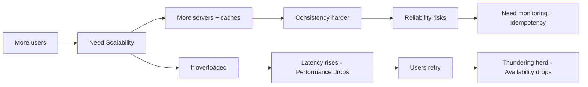

# System Design Fundamentals

Most developers think system design is only for senior engineers. **It isn't.**

You only need to understand the fundamentals first. Once you do, system design starts feeling like a superpower.

---

<a id="quick-index"></a>

## Quick index

| # | Section |
| --- | --- |
| <span id="i1"></span>1 | [What is System Design?](#p1) |
| <span id="i2"></span>2 | [Scalability](#p2) |
| <span id="i3"></span>3 | [Reliability](#p3) |
| <span id="i4"></span>4 | [Availability](#p4) |
| <span id="i5"></span>5 | [Performance](#p5) |
| <span id="i6"></span>6 | [How the Four Pillars Work Together](#p6) |
| <span id="i7"></span>7 | [Quick Revision Cheat Sheet](#p7) |

---

<a id="p1"></a>

## 1. What is System Design?

### Theory

**System design** is the process of defining how software components interact to meet product requirements — while balancing **scalability**, **reliability**, **availability**, **performance**, **cost**, and **security**.

You are not drawing boxes for fun. You are answering:

- Who uses the system and how?
- How much traffic and data will it handle?
- What happens when something fails?
- How fast should it feel?
- What are we willing to pay for?

### Pros & Cons

| Thinking in system design terms                     | Skipping it                              |
| --------------------------------------------------- | ---------------------------------------- |
| ✅ Catches bottlenecks before production            | ❌ "Works on my machine" breaks at scale |
| ✅ Clear trade-off conversations in interviews      | ❌ Over-engineering or under-engineering |
| ✅ Shared language across frontend, backend, DevOps | ❌ Siloed decisions that don't compose   |

### Real Example — Designing a Food Delivery App (Zomato / Swiggy style)

**Functional requirements**

- Users browse restaurants and place orders
- Restaurants accept and prepare orders
- Delivery partners get assigned in real time
- Users track order status

**Non-functional requirements**

- Support 10M daily active users
- Order placement under 500ms p95
- 99.9% availability during peak dinner hours
- No duplicate charges if user taps "Pay" twice

**High-level components you would name in an interview**

```
[Mobile/Web Client]
        ↓
[API Gateway / Load Balancer]
        ↓
[Order Service] [Restaurant Service] [Payment Service]
        ↓              ↓                    ↓
   [PostgreSQL]    [Redis Cache]      [Stripe / Razorpay]
        ↓
   [Kafka / SQS] → [Notification Service] → Push / SMS
```

You don't need every detail on day one. You need a **clear problem** and **major building blocks**.

### Interview Answer

> System design is architecting software so it meets functional requirements while staying scalable, reliable, available, and fast — with explicit trade-offs on cost and complexity.

---


<p><a href="#i1">Back to index</a></p>

<a id="p2"></a>

## 2. Scalability

### Theory

**Scalability** means your system can handle **growth** — more users, more requests, more data — **without breaking** or requiring a full rewrite.

Two common types:

| Type                               | Meaning                              | Example                                   |
| ---------------------------------- | ------------------------------------ | ----------------------------------------- |
| **Vertical scaling (scale up)**    | Bigger machine — more CPU, RAM, disk | Move DB from 8 GB → 64 GB RAM             |
| **Horizontal scaling (scale out)** | More machines working together       | Add 10 app servers behind a load balancer |

**Throughput** = requests handled per second.  
**Latency** = time for one request to complete.

Scaling often trades one for the other — more replicas improve throughput but add coordination overhead.

### Pros & Cons

| Vertical scaling              | Horizontal scaling                        |
| ----------------------------- | ----------------------------------------- |
| ✅ Simple — no code changes   | ✅ Near-unlimited growth                  |
| ✅ No distributed-system bugs | ✅ Fault isolation per node               |
| ❌ Hardware ceiling           | ❌ Needs load balancing, stateless design |
| ❌ Single point of failure    | ❌ Data consistency gets harder           |

### Real Example — Instagram Feed at Scale

**Problem:** 500M+ users open the app daily. Each user expects a personalized feed in under 1 second.

**Naive approach (breaks at scale)**

```text
GET /feed → Query DB for every followee's posts → Sort → Return
```

One user follows 500 accounts → 500 DB queries per feed load. At 1M concurrent users, the database dies.

**Scalable approach**

1. **Pre-compute feeds** — background workers write each user's feed into Redis when new posts arrive (fan-out on write for normal users).
2. **Hybrid fan-out** — celebrities with 10M followers use fan-out on read (pull at request time) to avoid writing 10M cache entries per post.
3. **Horizontal app servers** — stateless API pods behind a load balancer; scale from 50 → 500 pods during peak hours.
4. **Database sharding** — partition users/posts by `user_id % N` across multiple DB clusters.

```text
User opens app
    → API server (any of 200 pods)
    → Redis: GET feed:user:12345  (cache hit ~95%)
    → If miss: fan-out read from post shards + merge
    → Return JSON in <300ms
```

**Numbers to mention in interviews**

- Cache hit ratio target: **90–99%** for hot paths
- Stateless services scale linearly until the database becomes the bottleneck
- Shard when single-node write throughput or storage is exhausted

### Interview Answer

> Scalability is designing a system to grow with load — usually by scaling out stateless services horizontally, caching hot data, and partitioning databases when a single node can't keep up.

---


<p><a href="#i2">Back to index</a></p>

<a id="p3"></a>

## 3. Reliability

### Theory

**Reliability** means the system **works correctly and consistently** over time — including when parts fail.

Key ideas:

| Concept             | Meaning                                                         |
| ------------------- | --------------------------------------------------------------- |
| **Fault**           | Something breaks (disk crash, bad deploy, network blip)         |
| **Fault tolerance** | System keeps working despite faults                             |
| **Resilience**      | System recovers quickly after failure                           |
| **Idempotency**     | Repeating the same request doesn't cause duplicate side effects |

**MTBF** (Mean Time Between Failures) and **MTTR** (Mean Time To Recover) measure how often things break and how fast you fix them.

### Pros & Cons

| Building for reliability               | Ignoring it                             |
| -------------------------------------- | --------------------------------------- |
| ✅ Users trust the product             | ❌ Silent data loss, duplicate payments |
| ✅ Fewer 3 AM pages                    | ❌ Cascading failures                   |
| ✅ Easier compliance (finance, health) | ❌ Expensive firefighting               |

### Real Example — Payment Processing (Stripe-style)

**Failure scenario:** User clicks "Pay ₹499" on a slow network. The request times out. They click again.

**Without reliability design**

```text
Request 1: charge ₹499 → succeeds at bank, timeout returned to client
Request 2: charge ₹499 → succeeds again
Result: user charged ₹998
```

**Reliable design**

1. **Idempotency key** — client sends `Idempotency-Key: uuid-abc-123` with every payment attempt.
2. Server stores key → result mapping. Duplicate key returns the **same** response without re-charging.

```javascript
// Simplified payment handler
async function createPayment({ userId, amount, idempotencyKey }) {
  const existing = await db.payments.findByKey(idempotencyKey);
  if (existing) return existing; // safe retry

  const charge = await stripe.charges.create({ amount, customer: userId });

  return db.payments.insert({
    idempotencyKey,
    chargeId: charge.id,
    status: "succeeded",
  });
}
```

3. **Retries with exponential backoff** for transient network errors — only on **safe** (idempotent) operations.
4. **Dead-letter queue (DLQ)** for messages that fail after N retries — manual review instead of silent loss.

### Interview Answer

> Reliability means the system behaves correctly even when components fail — using redundancy, idempotent APIs, retries with backoff, and clear failure handling so errors don't become data corruption.

---


<p><a href="#i3">Back to index</a></p>

<a id="p4"></a>

## 4. Availability

### Theory

**Availability** is the fraction of time a system is **up and usable**.

```
Availability = Uptime / (Uptime + Downtime)
```

Common SLA targets:

| SLA                    | Downtime per year | Downtime per month |
| ---------------------- | ----------------- | ------------------ |
| 99% ("two nines")      | ~3.65 days        | ~7.2 hours         |
| 99.9% ("three nines")  | ~8.76 hours       | ~43 minutes        |
| 99.99% ("four nines")  | ~52 minutes       | ~4.3 minutes       |
| 99.999% ("five nines") | ~5 minutes        | ~26 seconds        |

**High availability (HA)** usually means:

- No single point of failure (load balancer, multi-AZ deployment)
- Health checks and automatic failover
- Graceful degradation (read-only mode, cached responses)

**Availability ≠ consistency.** You can be "up" but showing stale data.

### Pros & Cons

| High availability setup             | Single-server setup      |
| ----------------------------------- | ------------------------ |
| ✅ Survives zone/region failures    | ✅ Cheap and simple      |
| ✅ Rolling deploys without downtime | ❌ Every deploy is risky |
| ❌ More infrastructure cost         | ❌ Maintenance = outage  |

### Real Example — E-commerce Checkout on Prime Day (Amazon / Flipkart style)

**Goal:** 99.99% availability during a flash sale — checkout must work even if one data center has issues.

**Architecture**

```text
                    [Global DNS / Route 53]
                              ↓
              ┌───────────────┴───────────────┐
        [Region: Mumbai]              [Region: Singapore]
              ↓                              ↓
    [Load Balancer × 2]            [Load Balancer × 2]
              ↓                              ↓
    [App servers × 20]             [App servers × 20]
              ↓                              ↓
    [Primary DB] ←──replication──→ [Read Replica]
              ↓
    [Redis Cluster - 3 nodes, sentinel failover]
```

**Tactics**

1. **Multi-AZ** — if `ap-south-1a` fails, traffic routes to `ap-south-1b`.
2. **Circuit breaker** — if inventory service is down, show "try again" instead of hanging checkout for 30s.
3. **Queue orders** — accept order into Kafka; process payment async if payment gateway is slow (with clear UX).
4. **Health checks** — ALB removes unhealthy instances within seconds.

**Graceful degradation example**

```text
Recommendation service down → checkout still works, hide "You may also like"
Search slow → serve cached popular products
```

### Interview Answer

> Availability is keeping the service accessible — measured by uptime SLAs — using redundancy across zones, health checks, failover, and graceful degradation when non-critical dependencies fail.

---


<p><a href="#i4">Back to index</a></p>

<a id="p5"></a>

## 5. Performance

### Theory

**Performance** is how **fast** the system responds and how efficiently it uses resources.

Metrics interviewers expect:

| Metric                      | What it measures           | Good target (varies)          |
| --------------------------- | -------------------------- | ----------------------------- |
| **Latency (p50, p95, p99)** | Response time distribution | API p95 < 200–500ms           |
| **Throughput**              | Requests/sec (RPS)         | Match peak traffic + headroom |
| **Error rate**              | Failed requests / total    | < 0.1% for critical paths     |
| **Resource utilization**    | CPU, memory, disk I/O      | 60–70% avg (room for spikes)  |

**Latency vs throughput:** Optimizing one can hurt the other. Batching increases throughput but adds per-request wait time.

### Pros & Cons

| Aggressive performance tuning           | Premature optimization        |
| --------------------------------------- | ----------------------------- |
| ✅ Better UX, lower infra bill at scale | ❌ Complex code for 100 users |
| ✅ Required for search, feeds, gaming   | ❌ Harder to maintain         |
| Use profiling data to guide work        | Guesswork wastes time         |

### Real Example — Search Autocomplete (Google / Netflix search bar)

**Requirement:** Suggestions appear within **100ms** as the user types.

**Slow path (~800ms)**

```text
Keystroke → API → Full DB LIKE query on 100M rows → Sort → Return
```

**Fast path (~50ms)**

1. **CDN + edge** — static assets and API at edge PoPs close to users.
2. **Redis prefix index** — `TRE` → `["trending", "trek", "treatment"]` pre-built from popular queries.
3. **Debouncing on client** — wait 150ms after last keystroke before calling API (fewer requests).
4. **Connection pooling** — reuse DB connections; avoid TCP handshake per query.
5. **Read replicas** — search reads don't block write path.

```javascript
// Client: debounced autocomplete
const debouncedSearch = debounce(async (query) => {
  if (query.length < 2) return;
  const res = await fetch(`/api/suggest?q=${encodeURIComponent(query)}`);
  setSuggestions(await res.json());
}, 150);
```

```text
Server path:
  GET /api/suggest?q=tre
    → Redis ZRANGE suggest:tre 0 9   (~2ms)
    → If empty: fallback to Elasticsearch (~30ms)
    → Return top 10
```

**Measure, don't guess**

```text
p50: 45ms  |  p95: 120ms  |  p99: 280ms  |  RPS: 12,000
```

### Interview Answer

> Performance is delivering fast, predictable response times at required throughput — using caching, indexing, CDNs, async processing, and measuring p95/p99 latency instead of averages alone.

---


<p><a href="#i5">Back to index</a></p>

<a id="p6"></a>

## 6. How the Four Pillars Work Together

No pillar exists in isolation. Interviewers love "what breaks first?" questions.



### Scenario — Viral Tweet / Flash Sale

| Pillar       | What happens                 | Design response                  |
| ------------ | ---------------------------- | -------------------------------- |
| Scalability  | Traffic 100× in 10 minutes   | Auto-scale pods; queue writes    |
| Reliability  | Duplicate orders on retry    | Idempotency keys                 |
| Availability | DB connection pool exhausted | Circuit breaker; read from cache |
| Performance  | p99 latency 8s               | CDN; pre-warm cache; rate limit  |

---


<p><a href="#i6">Back to index</a></p>

<a id="p7"></a>

## 7. Quick Revision Cheat Sheet

| Topic             | One line                                                      |
| ----------------- | ------------------------------------------------------------- |
| **System Design** | Architecture that meets requirements with explicit trade-offs |
| **Scalability**   | Handle growth via scale-out, cache, shard, async              |
| **Reliability**   | Correct behavior under failure — idempotency, retries, DLQ    |
| **Availability**  | Uptime via redundancy, failover, graceful degradation         |
| **Performance**   | Low latency + high throughput — measure p95/p99               |

### The mindset (not complicated)

```text
System Design =
  Handling scale
+ Managing data
+ Designing reliable systems
+ Making smart engineering trade-offs
```

---

**Next:** [02-core-components.md](./02-core-components.md) — Client, application server, database, cache, load balancer, message queue, and external services.


<p><a href="#i7">Back to index</a></p>
