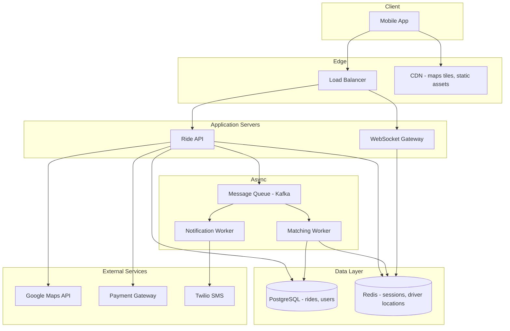

# System Design Core Components

Once you know the fundamentals (scalability, reliability, availability, performance), the next level is understanding **how real systems are built** — as connected components.

Each section maps to diagrams in [`../Advanced Topic/`](../Advanced%20Topic/) where available.

---

<a id="quick-index"></a>

## Quick index

| # | Section |
| --- | --- |
| <span id="i1"></span>1 | [Client](#p1) |
| <span id="i2"></span>2 | [Application Server](#p2) |
| <span id="i3"></span>3 | [Database](#p3) |
| <span id="i4"></span>4 | [Cache](#p4) |
| <span id="i5"></span>5 | [Load Balancer](#p5) |
| <span id="i6"></span>6 | [Message Queue](#p6) |
| <span id="i7"></span>7 | [External Services](#p7) |
| <span id="i8"></span>8 | [Full Stack Example — Ride Hailing App](#p8) |
| <span id="i9"></span>9 | [Quick Revision Cheat Sheet](#p9) |

---

<a id="p1"></a>

## 1. Client

### Theory

The **client** is where **users interact** with your application — mobile app, web browser, desktop app, IoT device, or CLI.

Responsibilities:

- Render UI and collect input
- Call APIs (REST, GraphQL, gRPC, WebSocket)
- Store local state (memory, localStorage, IndexedDB, SQLite)
- Handle offline / slow networks (retry, optimistic UI, caching)

### Pros & Cons

| Thick client (SPA / mobile)    | Thin client (server-rendered)        |
| ------------------------------ | ------------------------------------ |
| ✅ Rich interactivity          | ✅ Faster first paint, better SEO    |
| ✅ Less server load for UI     | ✅ Simpler client devices            |
| ❌ Larger bundles, client bugs | ❌ More round trips for interactions |

### Real Example — WhatsApp Web Client

```text
[User's Browser]
    ├── React UI (chat list, messages, media preview)
    ├── WebSocket connection (real-time messages)
    ├── Service Worker (offline draft messages, push notifications)
    └── Local IndexedDB (recent messages cache for instant open)
```

**Client-side patterns that affect system design**

```javascript
// Optimistic UI — show message immediately, reconcile on server ack
function sendMessage(text) {
  const tempId = `temp-${Date.now()}`;
  addMessageToUI({ id: tempId, text, status: "sending" });

  api
    .post("/messages", { text, clientId: tempId })
    .then((serverMsg) => replaceMessage(tempId, serverMsg))
    .catch(() => markMessageFailed(tempId));
}
```

**Interview talking points**

- Debounce search; paginate infinite lists; compress images before upload
- JWT in memory + refresh token in httpOnly cookie (security trade-off)
- WebSocket for chat; HTTP for profile updates

### Interview Answer

> The client is the user-facing layer — it renders the experience, calls backend APIs, manages local state, and implements resilience patterns like optimistic UI, caching, and retries.

---


<p><a href="#i1">Back to index</a></p>

<a id="p2"></a>

## 2. Application Server

### Theory

The **application server** (API layer / backend) **processes requests** and runs **business logic** — authentication, validation, orchestration, and calling databases or other services.

Characteristics of a well-designed app server:

- **Stateless** — any instance can handle any request (session in Redis/JWT)
- **Horizontally scalable** — add more pods behind a load balancer
- **Layered** — routes → controllers → services → repositories

### Pros & Cons

| Monolithic app server               | Microservices                              |
| ----------------------------------- | ------------------------------------------ |
| ✅ Simple deploy, easy local dev    | ✅ Independent scale and deploy per domain |
| ✅ No network between modules       | ✅ Team ownership per service              |
| ❌ One bug can take down everything | ❌ Distributed tracing, network latency    |

### Real Example — Netflix API Layer

```text
Client: "Play Stranger Things S4E1"
    ↓
[API Gateway] — auth, rate limit, routing
    ↓
[Playback Service] — verify subscription, region rights
    ↓
[CDN Signed URL Service] — generate time-limited stream URL
    ↓
[Recommendation Service] — "Up next" (async, non-blocking)
```

**Sample Node.js / Express handler**

```javascript
// POST /api/orders — orchestrates multiple steps
async function createOrder(req, res) {
  const { cartId, addressId } = req.body;
  const userId = req.user.id;

  // 1. Validate cart
  const cart = await cartService.getCart(userId, cartId);
  if (!cart.items.length) return res.status(400).json({ error: "Empty cart" });

  // 2. Reserve inventory (may call Inventory Service)
  const reservation = await inventoryService.reserve(cart.items);

  // 3. Create order record
  const order = await orderService.create({
    userId,
    items: cart.items,
    addressId,
  });

  // 4. Publish event — payment & notifications happen async
  await eventBus.publish("order.created", {
    orderId: order.id,
    reservationId: reservation.id,
  });

  res.status(201).json({ orderId: order.id, status: "pending_payment" });
}
```

### Interview Answer

> The application server executes business logic — validating requests, orchestrating data access, and publishing events — and should be stateless so you can scale it horizontally behind a load balancer.

---


<p><a href="#i2">Back to index</a></p>

<a id="p3"></a>

## 3. Database

### Theory

The **database** **stores and manages data** — the source of truth for users, orders, posts, etc.

Common types:

| Type                 | Best for                              | Examples                  |
| -------------------- | ------------------------------------- | ------------------------- |
| **Relational (SQL)** | Structured data, transactions, joins  | PostgreSQL, MySQL         |
| **Document**         | Flexible schemas, nested JSON         | MongoDB, DynamoDB         |
| **Key-value**        | Simple lookups, sessions              | Redis, DynamoDB           |
| **Wide-column**      | Massive write throughput, time-series | Cassandra, ScyllaDB       |
| **Search**           | Full-text, faceted search             | Elasticsearch, OpenSearch |
| **Graph**            | Relationships (friends, fraud)        | Neo4j                     |

Scaling patterns: **read replicas**, **sharding**, **partitioning**. See [Database Sharding](../Advanced%20Topic/Database%20Sharding.png) and [Replication](../Advanced%20Topic/Replication.png).

### Pros & Cons

| SQL                                      | NoSQL                                |
| ---------------------------------------- | ------------------------------------ |
| ✅ ACID transactions, strong consistency | ✅ Flexible schema, horizontal scale |
| ✅ Powerful queries (JOINs)              | ✅ High write throughput             |
| ❌ Harder to shard                       | ❌ Weaker consistency models         |

### Real Example — Twitter (X) — Storing Tweets

**Requirements**

- Write: 6,000 tweets/sec average (spikes much higher)
- Read: timeline reads vastly outnumber writes
- Each tweet: user_id, text, media URLs, created_at

**Storage design**

```text
[Tweets Table / Collection]
  tweet_id (PK)
  user_id
  content
  created_at
  shard_key = hash(user_id) % 1024

[Timeline Cache - Redis]
  key: timeline:{viewer_id}
  value: sorted list of tweet_ids (precomputed)

[Media] → Object storage (S3) + CDN URLs in DB
```

**SQL schema sketch**

```sql
CREATE TABLE tweets (
  id          BIGSERIAL PRIMARY KEY,
  user_id     BIGINT NOT NULL,
  content     TEXT NOT NULL,
  created_at  TIMESTAMPTZ DEFAULT NOW()
);

CREATE INDEX idx_tweets_user_created ON tweets (user_id, created_at DESC);
```

**Why index matters**

```text
Without index: full table scan — O(n) — 500ms on 100M rows
With index on (user_id, created_at): O(log n) — 5ms
```

### Interview Answer

> The database is the persistent source of truth — choose SQL vs NoSQL based on consistency needs and access patterns, then scale with indexes, read replicas, and sharding when a single node isn't enough.

---


<p><a href="#i3">Back to index</a></p>

<a id="p4"></a>

## 4. Cache

### Theory

A **cache** stores **frequently accessed data in fast storage** (usually memory) to **reduce latency** and **database load**.

Cache strategies:

| Strategy          | How it works                                     | Best for                 |
| ----------------- | ------------------------------------------------ | ------------------------ |
| **Cache-aside**   | App reads cache → on miss, read DB → write cache | General purpose          |
| **Write-through** | Write to cache and DB together                   | Strong consistency needs |
| **Write-behind**  | Write to cache first, async flush to DB          | Write-heavy bursts       |
| **TTL**           | Auto-expire after N seconds                      | News, sessions           |

See diagram: [Caching.png](../Advanced%20Topic/Caching.png)

**Cache invalidation** is one of the hardest problems — stale data vs complexity.

### Pros & Cons

| Caching                          | No cache                 |
| -------------------------------- | ------------------------ |
| ✅ Sub-ms reads, protects DB     | ✅ Always fresh data     |
| ✅ Handles traffic spikes        | ✅ Simpler mental model  |
| ❌ Stale data, invalidation bugs | ❌ DB becomes bottleneck |

### Real Example — Product Page on Amazon

**Hot path:** `GET /product/B08N5WRWNW` — millions of views per day, price changes occasionally.

```text
Request → Check Redis key product:B08N5WRWNW
    HIT  → return in 2ms
    MISS → SELECT * FROM products WHERE sku = ... (80ms)
         → SET redis key, TTL = 5 minutes
         → return
```

```javascript
async function getProduct(sku) {
  const cacheKey = `product:${sku}`;
  const cached = await redis.get(cacheKey);
  if (cached) return JSON.parse(cached);

  const product = await db.products.findBySku(sku);
  if (!product) return null;

  await redis.setex(cacheKey, 300, JSON.stringify(product)); // 5 min TTL
  return product;
}

// On price update — invalidate (don't wait for TTL)
async function updatePrice(sku, newPrice) {
  await db.products.update(sku, { price: newPrice });
  await redis.del(`product:${sku}`);
}
```

**CDN as edge cache** — static images served from nearest PoP. See [CDN](<../Advanced%20Topic/CDN(Content%20Delivery%20Network).png>).

### Interview Answer

> Cache keeps hot data in fast memory (Redis/CDN) to cut latency and database load — use cache-aside with TTLs and explicit invalidation on writes for data that changes.

---


<p><a href="#i4">Back to index</a></p>

<a id="p5"></a>

## 5. Load Balancer

### Theory

A **load balancer** **distributes incoming traffic** across multiple servers so no single machine is overwhelmed and failures are isolated.

Algorithms:

| Algorithm             | Behavior                        | Use case                  |
| --------------------- | ------------------------------- | ------------------------- |
| **Round robin**       | Rotate through servers          | Equal capacity, stateless |
| **Least connections** | Send to least busy server       | Long-lived connections    |
| **IP hash**           | Same client → same server       | Sticky sessions (limited) |
| **Weighted**          | More traffic to bigger machines | Mixed instance sizes      |

Layers:

- **L4 (TCP)** — fast, no HTTP awareness
- **L7 (HTTP)** — route by path, headers, cookies ([API Gateway](../Advanced%20Topic/API%20Gateway.png) extends this)

See diagram: [Load Balancer.png](../Advanced%20Topic/Load%20Balancer.png)

### Pros & Cons

| With load balancer                | Direct to one server            |
| --------------------------------- | ------------------------------- |
| ✅ Horizontal scale + HA          | ✅ No extra hop                 |
| ✅ Health checks remove bad nodes | ❌ Single point of failure      |
| ❌ Extra network hop (~1–5ms)     | ❌ Can't scale past one machine |

### Real Example — High-Traffic API (Stripe / GitHub API style)

```text
                    [Internet]
                        ↓
              [AWS ALB / NGINX]
               /      |      \
         [API-1]  [API-2]  [API-3]   ← stateless, same code
                        ↓
                  [PostgreSQL Primary]
                  [Read Replicas × 2]
```

**Health check config (conceptual)**

```nginx
upstream api_backend {
  server api-1:3000 max_fails=3 fail_timeout=30s;
  server api-2:3000 max_fails=3 fail_timeout=30s;
  server api-3:3000 max_fails=3 fail_timeout=30s;
}

server {
  location / {
    proxy_pass http://api_backend;
  }
}
```

**What happens when api-2 crashes**

```text
1. Health check fails 3 times (~30s)
2. LB stops routing traffic to api-2
3. Traffic spreads across api-1 and api-3
4. Auto-scaling group launches api-4
5. Users notice nothing (if capacity headroom exists)
```

### Interview Answer

> A load balancer spreads traffic across healthy server instances for scale and fault tolerance — use L7 routing when you need path-based rules and health checks to drop failed nodes automatically.

---


<p><a href="#i5">Back to index</a></p>

<a id="p6"></a>

## 6. Message Queue

### Theory

A **message queue** enables **asynchronous communication** between services — producers publish messages; consumers process them later.

Benefits:

- **Decouple** services (order service doesn't wait for email service)
- **Absorb spikes** (Black Friday orders queued, processed steadily)
- **Retry** failed work without blocking the user

Popular systems: **Kafka**, **RabbitMQ**, **AWS SQS**, **Redis Streams**, **Google Pub/Sub**.

Patterns:

| Pattern               | Description                           |
| --------------------- | ------------------------------------- |
| **Point-to-point**    | One consumer per message (task queue) |
| **Pub/Sub**           | Many subscribers receive same event   |
| **Dead-letter queue** | Failed messages after max retries     |

### Pros & Cons

| Async (queue)                       | Sync (direct HTTP)                  |
| ----------------------------------- | ----------------------------------- |
| ✅ Resilient to downstream slowness | ✅ Immediate consistency / response |
| ✅ Natural retry and backoff        | ✅ Simpler debugging                |
| ❌ Eventual consistency             | ❌ Cascading latency                |

### Real Example — Uber — Matching Rider to Driver

**Sync problem:** User requests ride → API calls matching, pricing, notification, analytics synchronously → 3s response, timeouts on spike.

**Async design**

```text
[Rider App] --POST /rides--> [Ride API]
                                  |
                                  v
                            [Kafka: ride.requested]
                           /         |         \
              [Matching Svc]  [Pricing Svc]  [Analytics Svc]
                     |
                     v
              [Kafka: ride.matched]
                     |
         [Notification Svc] → push to driver app
                     |
         [Ride API] → WebSocket update to rider
```

```javascript
// Producer — returns immediately
async function requestRide({ riderId, pickup, dropoff }) {
  const ride = await db.rides.create({
    riderId,
    pickup,
    dropoff,
    status: "searching",
  });
  await kafka.publish("ride.requested", { rideId: ride.id, pickup, dropoff });
  return { rideId: ride.id, status: "searching" };
}

// Consumer — matching worker
kafka.subscribe("ride.requested", async (event) => {
  const driver = await matchingEngine.findNearestDriver(event.pickup);
  if (driver) {
    await db.rides.update(event.rideId, {
      driverId: driver.id,
      status: "matched",
    });
    await kafka.publish("ride.matched", {
      rideId: event.rideId,
      driverId: driver.id,
    });
  } else {
    await retryOrCancel(event.rideId);
  }
});
```

### Interview Answer

> Message queues decouple services with async publish/consume — they absorb traffic spikes, enable retries, and let the API respond fast while background workers handle email, search indexing, or payment settlement.

---


<p><a href="#i6">Back to index</a></p>

<a id="p7"></a>

## 7. External Services

### Theory

**External services** are **third-party systems** your app integrates with — you don't control their uptime, latency, or API changes.

Common categories:

| Category    | Examples                           |
| ----------- | ---------------------------------- |
| Payments    | Stripe, Razorpay, PayPal           |
| Auth        | Auth0, Firebase Auth, Google OAuth |
| Email / SMS | SendGrid, Twilio, AWS SES          |
| Maps        | Google Maps, Mapbox                |
| Storage     | AWS S3, Cloudinary                 |
| ML / AI     | OpenAI, Google Vision              |

Design principles:

- **Never trust the network** — timeouts, retries, circuit breakers
- **Abstract behind an interface** — swap Stripe for Razorpay without rewriting checkout
- **Webhook idempotency** — payment provider may send duplicate events

### Pros & Cons

| Buy (external SaaS)                      | Build in-house                             |
| ---------------------------------------- | ------------------------------------------ |
| ✅ Faster time to market                 | ✅ Full control, no per-seat fees at scale |
| ✅ Compliance handled (PCI for payments) | ❌ You own security + uptime               |
| ❌ Vendor lock-in, rate limits           | ❌ Months of engineering                   |

### Real Example — SaaS App Using Multiple External Services

```text
[Your App]
    ├── Stripe — subscriptions + invoices
    ├── SendGrid — transactional email
    ├── Twilio — OTP SMS
    ├── S3 — user-uploaded PDFs
    └── Sentry — error monitoring
```

**Resilient Stripe webhook handler**

```javascript
async function handleStripeWebhook(req, res) {
  const event = stripe.webhooks.constructEvent(
    req.body,
    req.headers["stripe-signature"],
    SECRET,
  );

  // Idempotent — Stripe may retry webhooks
  if (await db.processedEvents.exists(event.id)) {
    return res.json({ received: true });
  }

  switch (event.type) {
    case "invoice.paid":
      await billingService.activateSubscription(event.data.object);
      break;
    case "invoice.payment_failed":
      await billingService.notifyPaymentFailure(event.data.object);
      break;
  }

  await db.processedEvents.insert(event.id);
  res.json({ received: true });
}
```

**Circuit breaker** — if Twilio is down, queue SMS for retry instead of blocking login.

### Interview Answer

> External services handle specialized capabilities (payments, email, maps) — wrap them with timeouts, retries, circuit breakers, and idempotent webhooks so third-party failures don't take down your core app.

---


<p><a href="#i7">Back to index</a></p>

<a id="p8"></a>

## 8. Full Stack Example — Ride Hailing App

How all seven components connect (Uber / Ola style):



**Request flow — book a ride**

```text
1. Client → LB → Ride API (auth via JWT, session in Redis)
2. API validates, writes ride row to PostgreSQL
3. API publishes ride.requested to Kafka → returns 202 + rideId
4. Matching worker consumes event, queries Redis GEO for nearby drivers
5. Worker updates DB, publishes ride.matched
6. WebSocket pushes status to client; Twilio SMS backup if app closed
7. On trip end → Payment external API charged; receipt email via SendGrid
```

---


<p><a href="#i8">Back to index</a></p>

<a id="p9"></a>

## 9. Quick Revision Cheat Sheet

| Component              | Role                          | Example product                 |
| ---------------------- | ----------------------------- | ------------------------------- |
| **Client**             | User interaction              | WhatsApp Web, React Native app  |
| **Application Server** | Business logic, orchestration | Order API, Playback service     |
| **Database**           | Persistent source of truth    | PostgreSQL tweets table         |
| **Cache**              | Fast reads, protect DB        | Redis product pages, CDN images |
| **Load Balancer**      | Distribute traffic            | AWS ALB in front of API pods    |
| **Message Queue**      | Async, decoupled work         | Kafka for ride matching         |
| **External Services**  | Third-party capabilities      | Stripe, Twilio, S3              |

---

**Next:** [03-design-process.md](./03-design-process.md) — requirements, high-level architecture, trade-offs, security, and monitoring.


<p><a href="#i9">Back to index</a></p>
