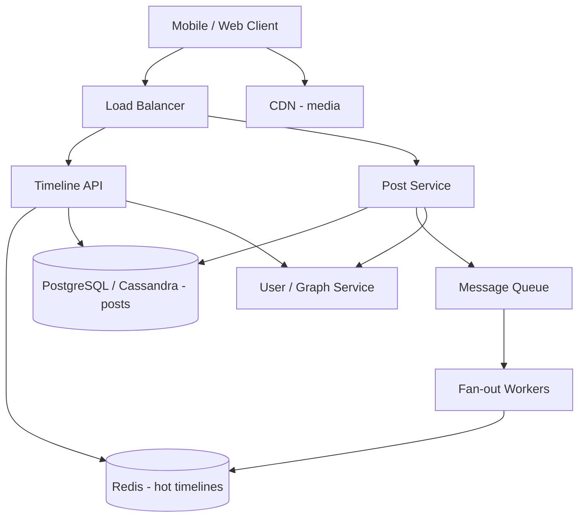
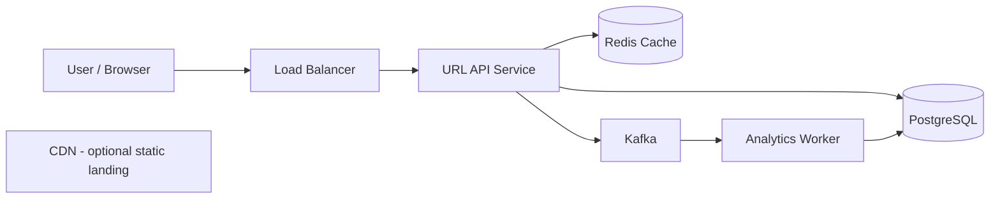

# System Design Process

Fundamentals tell you **what** to optimize. Components tell you **what to draw**. This guide covers **how to design** — the repeatable process used in interviews and real projects.

---

## Table of Contents

1. [Understand Requirements](#1-understand-requirements)
2. [Design High-Level Architecture](#2-design-high-level-architecture)
3. [Consider Trade-offs](#3-consider-trade-offs)
4. [Plan for Security](#4-plan-for-security)
5. [Monitor & Scale](#5-monitor--scale)
6. [Full Walkthrough — URL Shortener (bit.ly style)](#6-full-walkthrough--url-shortener-bitly-style)
7. [Quick Revision Cheat Sheet](#7-quick-revision-cheat-sheet)

---

## 1. Understand Requirements

### Theory

Never jump to diagrams. **Define the problem clearly** first.

Split requirements into two buckets:

| Type               | Questions to ask                                                                    |
| ------------------ | ----------------------------------------------------------------------------------- |
| **Functional**     | What features? Who are the actors? What are the main flows?                         |
| **Non-functional** | How many users? Read/write ratio? Latency target? Availability SLA? Data retention? |

Also clarify **scope** with the interviewer:

- MVP vs full product
- Mobile only or web too?
- Global or single region?
- Consistency requirements (banking vs social feed)

### Pros & Cons

| Clarifying upfront          | Assuming requirements  |
| --------------------------- | ---------------------- |
| ✅ Right-sized architecture | ❌ Over/under-engineer |
| ✅ Shows product thinking   | ❌ Wrong trade-offs    |
| ✅ Saves redesign time      | ❌ Interview red flag  |

### Real Example — Designing "Pastebin" / Code Share

**Bad start:** "I'll use Kafka, Cassandra, and Kubernetes."

**Good start — questions you ask**

```text
1. Functional: upload text, get shareable link, optional expiry?
2. Scale: 10K or 10M pastes per day?
3. Read/write ratio: mostly writes or mostly reads?
4. Max paste size: 1 KB or 10 MB?
5. Anonymous or user accounts?
6. Latency: p95 < 200ms for read?
7. Durability: can we ever lose a paste?
```

**Documented requirements (example answer)**

```text
Functional:
  - Create paste → return short URL
  - Read paste by short code
  - Optional TTL (expire after 7 days)

Non-functional:
  - 10M new pastes/month (~4 writes/sec avg, spikes 10×)
  - 100M reads/month (~40 reads/sec avg)
  - p95 read latency < 100ms
  - 99.9% availability
  - Max paste size: 100 KB
```

### Interview Answer

> I start by separating functional from non-functional requirements, asking about scale, read/write ratio, latency, availability, and data size — then I scope the MVP so the design matches the actual problem.

---

## 2. Design High-Level Architecture

### Theory

**High-level architecture (HLA)** maps the **major components** and **how data flows** between them — not class-level detail.

A typical HLA includes:

```text
[Clients] → [CDN / LB] → [API Services] → [Cache] → [Database]
                              ↓
                        [Message Queue] → [Workers]
                              ↓
                        [External Services]
```

Steps:

1. Draw clients and entry point (LB, API gateway)
2. Identify core services (read path vs write path)
3. Place data stores (primary DB, cache, object storage)
4. Add async workers if needed
5. Label external dependencies

See [Microservice.png](../Advanced%20Topic/Microservice.png) for service decomposition patterns.

### Pros & Cons

| Start with HLA                  | Jump to database schema first       |
| ------------------------------- | ----------------------------------- |
| ✅ See bottlenecks early        | ❌ Miss async / cache opportunities |
| ✅ Easy to explain in 5 minutes | ❌ Coupled to one technology choice |
| ✅ Iterate depth where needed   | ❌ Hard to reason about scale       |

### Real Example — News Feed (Twitter / LinkedIn style)

**Requirements recap:** 50M DAU, post tweet, view home timeline, follow users.

**HLA diagram**



**Read path (hot)**

```text
GET /timeline
  → Timeline API
  → Redis GET timeline:user:42 (precomputed tweet IDs)
  → Hydrate tweet details (batch GET from DB or cache)
  → Return JSON
```

**Write path**

```text
POST /tweets { text }
  → Post Service → persist to DB
  → Publish tweet.created to Kafka
  → Fan-out workers push tweet ID to each follower's Redis timeline
  → Return 201 immediately (don't wait for full fan-out)
```

### Interview Answer

> I sketch clients, load balancer, core services, cache, database, and async workers — then walk through one read flow and one write flow so the interviewer sees how data moves end to end.

---

## 3. Consider Trade-offs

### Theory

There is **no perfect design** — only choices with costs. Strong candidates **name trade-offs explicitly**.

Classic trade-offs:

| Trade-off                             | Options                                        | Rule of thumb                                     |
| ------------------------------------- | ---------------------------------------------- | ------------------------------------------------- |
| **Consistency vs Availability** (CAP) | Strong consistency vs stay up during partition | Banking → consistency; social feed → availability |
| **Latency vs Throughput**             | Small fast requests vs batched bulk            | User-facing → latency; analytics → throughput     |
| **Cost vs Performance**               | Bigger fleet + cache vs minimal infra          | Start simple; scale what metrics prove is slow    |
| **Sync vs Async**                     | Immediate response vs eventual consistency     | User waiting → sync; emails, search index → async |
| **SQL vs NoSQL**                      | Joins + ACID vs horizontal write scale         | Complex relations → SQL; massive KV → NoSQL       |
| **Normalization vs Denormalization**  | Less duplication vs faster reads               | Read-heavy → denormalize                          |

**CAP theorem (practical version):** During a network partition, you choose **CP** (consistent but may reject requests) or **AP** (available but may return stale data).

### Pros & Cons

| Stating trade-offs            | Picking one "best" solution |
| ----------------------------- | --------------------------- |
| ✅ Shows senior judgment      | ❌ Sounds junior / dogmatic |
| ✅ Aligns with business needs | ❌ Wrong for the use case   |

### Real Example — E-commerce Inventory

**Scenario:** 100 people try to buy the last iPhone in stock at the same second.

| Approach                                   | Trade-off                                  |
| ------------------------------------------ | ------------------------------------------ |
| **Pessimistic lock** (`SELECT FOR UPDATE`) | Strong consistency; locks hurt throughput  |
| **Optimistic lock** (version column)       | Higher throughput; retries on conflict     |
| **Reserve in Redis** (`DECR stock`)        | Very fast; must sync to DB carefully       |
| **Oversell allowed + apology email**       | Max availability; bad UX for premium brand |

**Redis reservation pattern**

```javascript
async function purchase(sku, userId) {
  const remaining = await redis.decr(`stock:${sku}`);
  if (remaining < 0) {
    await redis.incr(`stock:${sku}`); // rollback
    throw new Error("Out of stock");
  }

  try {
    await db.orders.create({ sku, userId, status: "confirmed" });
    await kafka.publish("inventory.decremented", { sku });
  } catch (err) {
    await redis.incr(`stock:${sku}`); // release reservation on failure
    throw err;
  }
}
```

**What to say in the interview**

> "For a flash sale I'd use Redis atomic decrement for speed with a sync worker to PostgreSQL. We accept brief eventual consistency on the admin dashboard but not on the user's order confirmation — that must be strongly consistent once payment succeeds."

### Interview Answer

> Every design choice has a cost — I articulate consistency vs availability, sync vs async, and SQL vs NoSQL based on whether the business prioritizes correctness, uptime, or speed.

---

## 4. Plan for Security

### Theory

Security is not a final slide — it shapes architecture from the start.

Core areas:

| Area                 | What to protect   | Common controls                                                                             |
| -------------------- | ----------------- | ------------------------------------------------------------------------------------------- |
| **Authentication**   | Who is this user? | OAuth 2.0, JWT, sessions, MFA                                                               |
| **Authorization**    | What can they do? | RBAC, ABAC, resource-level checks                                                           |
| **Data in transit**  | Network sniffing  | TLS 1.2+, HTTPS everywhere                                                                  |
| **Data at rest**     | Disk theft        | AES-256 encryption, KMS                                                                     |
| **Input validation** | Injection attacks | Parameterized queries, sanitization                                                         |
| **Rate limiting**    | Abuse, DDoS       | Token bucket per IP/user — see [Rate Limiting.png](../Advanced%20Topic/Rate%20Limiting.png) |
| **Secrets**          | Leaked API keys   | Vault, env vars, never in git                                                               |

**OWASP Top 10** — know SQL injection, XSS, broken access control, SSRF at a high level.

### Pros & Cons

| Security by design              | Bolt-on security later       |
| ------------------------------- | ---------------------------- |
| ✅ Cheaper, fewer breaches      | ❌ Costly retrofit           |
| ✅ Compliance ready (GDPR, PCI) | ❌ Architecture may be wrong |

### Real Example — Healthcare Portal (HIPAA-aware)

**Threat:** Attacker guesses `/api/records/1001`, `/api/records/1002` …

**Broken design**

```javascript
// ❌ IDOR — Insecure Direct Object Reference
app.get("/api/records/:id", async (req, res) => {
  const record = await db.records.find(req.params.id);
  res.json(record); // no ownership check
});
```

**Secure design**

```javascript
app.get("/api/records/:id", authenticate, async (req, res) => {
  const record = await db.records.find(req.params.id);

  // Authorization — user can only read own records (or doctor with grant)
  if (!canAccessRecord(req.user, record)) {
    return res.status(403).json({ error: "Forbidden" });
  }

  auditLog.write({ userId: req.user.id, action: "read", recordId: record.id });
  res.json(redactSensitiveFields(record, req.user.role));
});
```

**Additional layers**

```text
[WAF] → blocks SQLi, XSS at edge
[API Gateway] → rate limit 100 req/min per user
[Service] → mTLS between internal microservices
[DB] → encrypted at rest, least-privilege DB user
[Logs] → no PII in plain text; centralized SIEM alerts
```

### Interview Answer

> I bake in authn/authz at the API layer, encrypt data in transit and at rest, validate all inputs, rate-limit public endpoints, and audit access to sensitive resources — especially preventing IDOR and injection.

---

## 5. Monitor & Scale

### Theory

A system without observability is **flying blind**. Monitoring tells you when to scale and what broke.

**Three pillars of observability**

| Pillar      | What                                  | Tools (examples)                |
| ----------- | ------------------------------------- | ------------------------------- |
| **Metrics** | Numbers over time (RPS, CPU, error %) | Prometheus, Datadog, CloudWatch |
| **Logs**    | Discrete events with context          | ELK, Loki, CloudWatch Logs      |
| **Traces**  | Request path across services          | Jaeger, Zipkin, OpenTelemetry   |

**Key alerts**

- Error rate > 1% for 5 minutes
- p95 latency > 2× baseline
- Disk > 80%, connection pool exhausted
- Queue depth growing unbounded

**Scaling triggers**

| Signal               | Action                          |
| -------------------- | ------------------------------- |
| CPU > 70% sustained  | Add app server replicas         |
| DB read latency high | Add read replicas               |
| Redis memory > 80%   | Eviction policy + cluster scale |
| Kafka lag increasing | Add consumers                   |

### Pros & Cons

| Proactive monitoring          | Reactive ("users report bugs") |
| ----------------------------- | ------------------------------ |
| ✅ Lower MTTR, SLO compliance | ❌ Long outages, revenue loss  |
| ✅ Data-driven scaling        | ❌ Guesswork capacity planning |

### Real Example — Video Streaming Service (Hotstar / YouTube style)

**SLO:** 99.9% of video starts within 3 seconds.

**Dashboard metrics**

```text
- playback.start.latency.p95
- cdn.cache_hit_ratio
- api.errors.rate by endpoint
- origin.bandwidth.gbps
- concurrent.streams (gauge)
```

**Auto-scaling rule**

```yaml
# Conceptual K8s HPA
apiVersion: autoscaling/v2
kind: HorizontalPodAutoscaler
spec:
  minReplicas: 20
  maxReplicas: 500
  metrics:
    - type: Resource
      resource:
        name: cpu
        target:
          type: Utilization
          averageUtilization: 65
```

**Incident playbook excerpt**

```text
Alert: cdn.cache_hit_ratio dropped from 92% → 61%
  1. Check if origin is overloaded (trace sample requests)
  2. Verify CDN config / certificate expiry
  3. Pre-warm cache for top 100 titles
  4. Scale origin transcoding workers if new release dropped
```

**Load test before launch**

```text
k6 / Locust simulate 500K concurrent viewers
  → watch p95, error rate, DB connections
  → fix bottleneck BEFORE marketing campaign
```

### Interview Answer

> I define SLOs, instrument metrics/logs/traces, alert on error rate and latency regressions, auto-scale stateless tiers on CPU/RPS, and load-test before expected traffic spikes.

---

## 6. Full Walkthrough — URL Shortener (bit.ly style)

Apply all five steps to one complete problem.

### Step 1 — Requirements

```text
Functional:
  - Long URL → short code (e.g. abc12)
  - Redirect short URL → original long URL
  - Optional custom alias (premium)
  - Link analytics (click count) — nice to have

Non-functional:
  - 100M new URLs/month (~40 writes/sec avg)
  - 10:1 read-to-write ratio → ~400 redirects/sec avg
  - p95 redirect < 100ms
  - 99.99% availability
  - URLs stored indefinitely unless expired
```

**Back-of-envelope**

```text
100M URLs/month × 500 bytes avg ≈ 50 GB/month metadata
5-year storage ≈ 3 TB → fits on managed SQL + cache
```

### Step 2 — High-Level Architecture



**Short code generation**

```text
Option A: Base62 encode auto-increment ID (simple, no collision)
Option B: Random 7-char string + unique index (distributed friendly)
Chosen: Base62(ID) — 7 chars = 62^7 ≈ 3.5 trillion URLs
```

```javascript
const BASE62 = "0123456789abcdefghijklmnopqrstuvwxyzABCDEFGHIJKLMNOPQRSTUVWXYZ";

function encodeId(num) {
  if (num === 0) return BASE62[0];
  let s = "";
  while (num > 0) {
    s = BASE62[num % 62] + s;
    num = Math.floor(num / 62);
  }
  return s;
}
```

### Step 3 — Trade-offs

| Decision      | Choice                    | Why                                |
| ------------- | ------------------------- | ---------------------------------- |
| Read path     | Cache-aside Redis         | Redirects are read-heavy           |
| Write path    | Sync DB + async analytics | User needs short URL immediately   |
| DB            | PostgreSQL                | Strong uniqueness on short_code    |
| Consistency   | CP on create              | Duplicate short codes unacceptable |
| ID generation | DB sequence or Snowflake  | Avoid coordination storms          |

**Redirect flow**

```javascript
async function redirect(shortCode) {
  const cached = await redis.get(`url:${shortCode}`);
  if (cached) {
    kafka.publish("link.clicked", { shortCode }); // async analytics
    return res.redirect(301, cached);
  }

  const row = await db.urls.findByCode(shortCode);
  if (!row) return res.status(404).send("Not found");

  await redis.setex(`url:${shortCode}`, 3600, row.longUrl);
  kafka.publish("link.clicked", { shortCode });
  return res.redirect(301, row.longUrl);
}
```

### Step 4 — Security

```text
- Rate limit: 10 creates/min per IP (prevent abuse)
- Blocklist malicious domains (phishing scan on create)
- Don't expose internal IDs in API errors
- Admin analytics behind auth
- HTTPS only; HSTS header on redirect domain
```

```javascript
async function createShortUrl(longUrl, userId) {
  if (!isValidUrl(longUrl)) throw new ValidationError();
  if (await blocklist.contains(longUrl)) throw new ForbiddenError();

  const id = await db.nextId();
  const shortCode = encodeId(id);
  await db.urls.insert({ shortCode, longUrl, userId });
  return `https://short.example/${shortCode}`;
}
```

### Step 5 — Monitor & Scale

```text
Metrics:
  - redirect.latency.p95
  - cache.hit_ratio (target > 95%)
  - create.errors.rate
  - kafka.consumer.lag

Scale:
  - Stateless API: HPA 5 → 50 pods
  - Redis cluster when memory > 70%
  - Read replicas if analytics queries hurt primary

Alerts:
  - p95 redirect > 200ms for 10 min
  - cache hit ratio < 80%
```

---

## 7. Quick Revision Cheat Sheet

| Step                | Key question              | Deliverable                      |
| ------------------- | ------------------------- | -------------------------------- |
| **Requirements**    | What & how much?          | Functional + non-functional list |
| **HLA**             | What are the major boxes? | Diagram + read/write flows       |
| **Trade-offs**      | What are we giving up?    | CAP, sync/async, SQL/NoSQL       |
| **Security**        | What can go wrong?        | Auth, encryption, rate limits    |
| **Monitor & Scale** | How do we stay healthy?   | SLOs, metrics, alerts, HPA       |

### The complete mindset

```text
Most people make System Design look complicated. It isn't.

→ Handling scale.        (Scalability)
→ Managing data.         (Database, Cache)
→ Designing reliable systems. (Reliability, Availability)
→ Making smart trade-offs. (Process step 3)
```

### 5-minute interview opener template

```text
"Let me clarify requirements… [ask 3–4 questions]"
"Assuming X users and Y read/write ratio, here's the HLA…"
"For the read path I'd use cache because…"
"The main trade-off is A vs B; I'd choose B because…"
"I'd secure this with… and monitor…"
```

---

**You now have the full path:**

1. [01-system-design-fundamentals.md](./01-system-design-fundamentals.md) — pillars
2. [02-core-components.md](./02-core-components.md) — building blocks
3. **This file** — how to design end to end

Pair with diagrams in [../Advanced Topic/](../Advanced%20Topic/) for visual revision.
