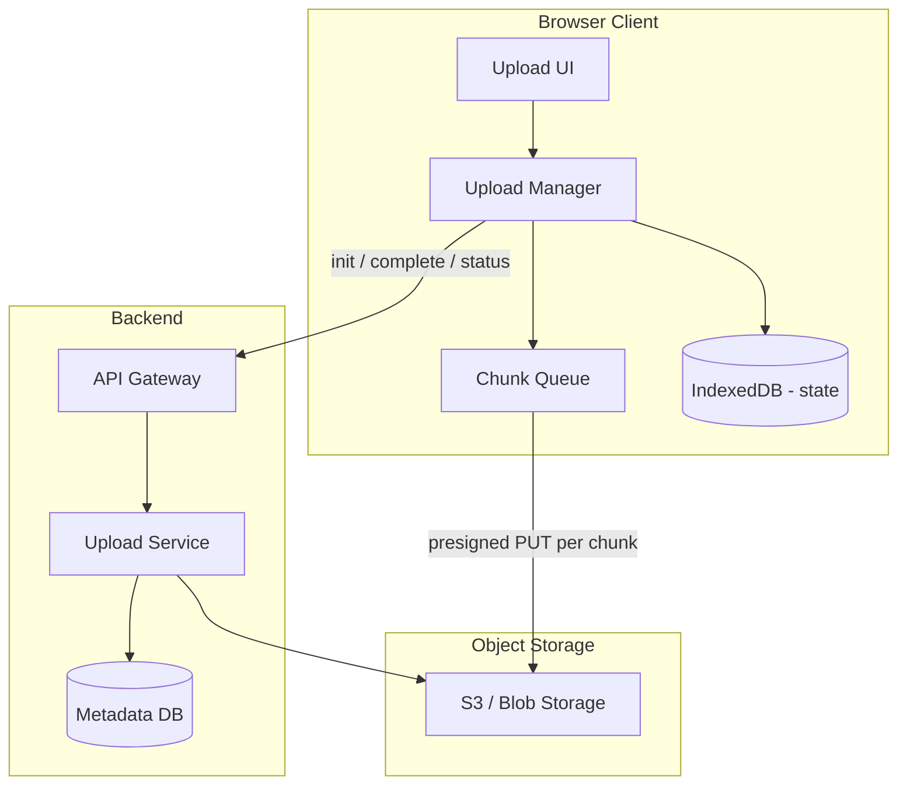

# KPMG Frontend Interview — File Upload System Design

**Duration:** 90 minutes  
**Problem:** Design a **Dropbox / Google Drive–style** file upload system with chunking, pause/resume, progress tracking, and retry.

**Prep resource:** [System design guide](https://lnkd.in/dMRgTAMD)

**Other rounds:** [Round 1 — JavaScript](../Javascript/kpmg-round-1-vanilla-javascript-interview.md) · [Round 2 — React](../React/23-kpmg-frontend-interview.md)

---

## Table of Contents

1. [Clarify Requirements](#1-clarify-requirements)
2. [High-Level Architecture](#2-high-level-architecture)
3. [Chunking Strategy](#3-chunking-strategy)
4. [Pause, Resume & Progress](#4-pause-resume--progress-tracking)
5. [Retry & Error Handling](#5-retry--error-handling)
6. [Frontend Implementation](#6-frontend-implementation)
7. [Backend API Design](#7-backend-api-design)
8. [Performance & Scalability](#8-performance--scalability)
9. [Security Considerations](#9-security-considerations)
10. [What to Draw in the Interview](#10-what-to-draw-in-the-interview)
11. [Quick Revision Cheat Sheet](#11-quick-revision-cheat-sheet)

---

## 1. Clarify Requirements

### Functional requirements

| Requirement        | Detail                                               |
| ------------------ | ---------------------------------------------------- |
| Upload files       | Drag-drop, file picker, folder upload (stretch)      |
| Chunking           | Split large files into parts                         |
| Pause / resume     | User can pause; resume after refresh or network drop |
| Progress           | Per-file and per-chunk progress bar                  |
| Retry              | Failed chunks retry without re-uploading whole file  |
| Concurrent uploads | Multiple files; limited parallel chunks              |

### Non-functional requirements

| Requirement  | Target                                            |
| ------------ | ------------------------------------------------- |
| File size    | Up to **5 GB** per file                           |
| Reliability  | No duplicate corrupt files; resumable after crash |
| Performance  | Saturate bandwidth without blocking UI            |
| Availability | Upload works on flaky mobile networks             |
| Security     | Auth, virus scan hook, encrypted in transit       |

### Out of scope (state in interview)

- Real-time collaborative editing
- Version history UI
- Desktop sync client (mention as future)

### Interview Answer

> I'd clarify max file size, concurrent upload limits, whether resume must survive browser close, and if uploads go direct-to-S3 or through the app server — those drive chunk size, storage API, and state persistence.

---

## 2. High-Level Architecture



### Flow overview

```text
1. Client selects file → hash + metadata
2. POST /uploads/init → server returns uploadId, chunkSize, presigned URLs (or upload token)
3. Client slices file into chunks → uploads each chunk in parallel (pool of 3–6)
4. Each chunk: PUT to storage with Content-Range / part number
5. On all parts done: POST /uploads/complete → server assembles / verifies ETags
6. Progress persisted in IndexedDB — resume after refresh
```

### Interview Answer

> Clients talk to an Upload Manager that chunks files, uploads parts directly to object storage via presigned URLs, persists state in IndexedDB, and calls a completion API so the server assembles metadata and verifies integrity.

---

## 3. Chunking Strategy

### Theory

| Parameter            | Typical value                        | Why                                           |
| -------------------- | ------------------------------------ | --------------------------------------------- |
| **Chunk size**       | 5–10 MB                              | Balance retry cost vs request count           |
| **Parallel chunks**  | 3–6                                  | Avoid browser connection limit (6 per domain) |
| **File fingerprint** | SHA-256 of first + last chunk + size | Dedup / resume identity                       |

**Why chunk?**

- Serverless / reverse proxy **body size limits** (e.g. 4.5 MB)
- **Resume** only failed parts
- **Progress** granularity
- **Memory** — don't load 5 GB into RAM

### Real Example — Slice file in browser

```typescript
const CHUNK_SIZE = 8 * 1024 * 1024; // 8 MB

function createChunks(file: File): Blob[] {
  const chunks: Blob[] = [];
  let offset = 0;

  while (offset < file.size) {
    const end = Math.min(offset + CHUNK_SIZE, file.size);
    chunks.push(file.slice(offset, end));
    offset = end;
  }

  return chunks;
}

// Content hash for resume key (simplified — production use spark-md5 or crypto.subtle)
async function fileFingerprint(file: File): Promise<string> {
  const sample =
    file.size > CHUNK_SIZE * 2
      ? new Blob([file.slice(0, CHUNK_SIZE), file.slice(-CHUNK_SIZE)])
      : file;
  const buffer = await sample.arrayBuffer();
  const hash = await crypto.subtle.digest("SHA-256", buffer);
  return `${file.name}-${file.size}-${bufToHex(hash)}`;
}
```

### Pros & Cons

| Small chunks (1 MB)        | Large chunks (50 MB)        |
| -------------------------- | --------------------------- |
| ✅ Fine-grained retry      | ✅ Fewer HTTP requests      |
| ❌ More requests, overhead | ❌ Painful retry on failure |
| Good for unstable network  | Good for datacenter uplink  |

### Interview Answer

> I'd use 5–10 MB chunks with 3–6 parallel uploads, slicing via `File.slice()` so we never hold the full file in memory, and fingerprint files for resume keys.

---

## 4. Pause, Resume & Progress Tracking

### Theory

**State machine per file**

```text
idle → hashing → uploading → paused → uploading → completing → done
                      ↓                      ↑
                    failed ──retry───────────┘
```

**Persist in IndexedDB**

```typescript
type UploadRecord = {
  uploadId: string;
  fileName: string;
  fileSize: number;
  fingerprint: string;
  chunkSize: number;
  completedParts: number[]; // e.g. [0, 1, 2, 5] — part 3,4 failed
  status: "uploading" | "paused" | "completed" | "failed";
  createdAt: number;
};
```

**Progress calculation**

```text
overall = (sum of completed chunk bytes) / fileSize × 100
speed   = bytes uploaded in last 1s window
ETA     = (remaining bytes) / speed
```

### Real Example — Upload manager with pause

```typescript
class UploadManager {
  private abortControllers = new Map<number, AbortController>();
  private paused = false;

  pause() {
    this.paused = true;
    this.abortControllers.forEach((ac) => ac.abort());
    this.abortControllers.clear();
  }

  async resume(record: UploadRecord, file: File) {
    this.paused = false;
    const chunks = createChunks(file);
    const pending = chunks
      .map((_, i) => i)
      .filter((i) => !record.completedParts.includes(i));

    await this.uploadParts(record, chunks, pending);
  }

  async uploadParts(
    record: UploadRecord,
    chunks: Blob[],
    partIndexes: number[],
  ) {
    const pool = new ConcurrencyPool(4);

    await Promise.all(
      partIndexes.map((partIndex) =>
        pool.run(() =>
          this.uploadOnePart(record, chunks[partIndex], partIndex),
        ),
      ),
    );
  }

  private async uploadOnePart(
    record: UploadRecord,
    blob: Blob,
    partIndex: number,
  ) {
    if (this.paused) return;

    const ac = new AbortController();
    this.abortControllers.set(partIndex, ac);

    const url = await getPresignedUrl(record.uploadId, partIndex);

    await fetchWithRetry(url, {
      method: "PUT",
      body: blob,
      signal: ac.signal,
      headers: { "Content-Type": "application/octet-stream" },
    });

    record.completedParts.push(partIndex);
    await saveToIndexedDB(record);
    this.emitProgress(record);
  }
}
```

### Interview Answer

> Each upload is a state machine persisted in IndexedDB — completed part numbers, uploadId, fingerprint. Pause aborts in-flight requests; resume uploads only missing parts and recalculates progress from bytes completed.

---

## 5. Retry & Error Handling

### Theory

| Error type                  | Strategy                                 |
| --------------------------- | ---------------------------------------- |
| **Network timeout**         | Exponential backoff retry (3–5 attempts) |
| **4xx (except 429)**        | Don't retry — show user error            |
| **429 / 503**               | Backoff + reduce concurrency             |
| **Chunk checksum mismatch** | Re-upload that chunk only                |
| **Complete API fails**      | Idempotent complete with same uploadId   |

```typescript
async function fetchWithRetry(
  url: string,
  options: RequestInit,
  maxRetries = 5,
): Promise<Response> {
  let delay = 1000;

  for (let attempt = 0; attempt <= maxRetries; attempt++) {
    try {
      const res = await fetch(url, options);
      if (res.ok) return res;
      if (res.status >= 400 && res.status < 500 && res.status !== 429) {
        throw new Error(`Client error ${res.status}`);
      }
    } catch (err) {
      if (options.signal?.aborted) throw err;
      if (attempt === maxRetries) throw err;
    }

    await sleep(delay);
    delay = Math.min(delay * 2, 30000);
  }

  throw new Error("Unreachable");
}
```

### Duplicate completion — idempotency

```text
POST /uploads/complete { uploadId, parts: [{ partNumber, etag }] }
Server: if uploadId already completed → return same fileId (idempotent)
```

### Interview Answer

> I retry transient failures with exponential backoff, never blindly retry 4xx, re-upload only failed chunks, and make the complete endpoint idempotent so duplicate calls don't create duplicate files.

---

## 6. Frontend Implementation

### Component structure

```text
components/
  DropZone.tsx           — drag-drop, file input
  UploadList.tsx         — list of files
  UploadItem.tsx         — progress bar, pause/resume/cancel
lib/
  upload-manager.ts      — chunking, queue, pool
  indexed-db.ts          — persist UploadRecord
  api.ts                 — init / complete / presign
hooks/
  useUpload.ts           — bridge UI ↔ manager
```

### Real Example — React hook

```tsx
"use client";

import { useCallback, useState } from "react";
import { UploadManager } from "@/lib/upload-manager";

export function useUpload() {
  const [jobs, setJobs] = useState<UploadJob[]>([]);
  const manager = useRef(new UploadManager());

  const addFiles = useCallback(async (files: FileList) => {
    for (const file of Array.from(files)) {
      const job = await manager.current.enqueue(file);
      setJobs((prev) => [...prev, job]);
    }
  }, []);

  const pause = (id: string) => manager.current.pause(id);
  const resume = (id: string) => manager.current.resume(id);

  return { jobs, addFiles, pause, resume };
}
```

```tsx
export function UploadItem({ job, onPause, onResume }: UploadItemProps) {
  const pct = Math.round((job.bytesUploaded / job.fileSize) * 100);

  return (
    <li className="upload-item">
      <span>{job.fileName}</span>
      <progress value={pct} max={100} />
      <span>
        {pct}% · {formatSpeed(job.speed)}
      </span>
      {job.status === "uploading" && (
        <button onClick={() => onPause(job.id)}>Pause</button>
      )}
      {job.status === "paused" && (
        <button onClick={() => onResume(job.id)}>Resume</button>
      )}
    </li>
  );
}
```

### UX details interviewers notice

- **Web Worker** for hashing large files (don't block UI)
- **`requestIdleCallback`** for non-critical work
- Show **indeterminate** state during hash/init
- **Cancel** removes partial parts via `DELETE /uploads/:id` (server lifecycle rule)

### Interview Answer

> I'd separate UploadManager (chunk queue, retry, IndexedDB) from presentational components, use a hook for state, and offload hashing to a Web Worker so the UI stays responsive during multi-GB uploads.

---

## 7. Backend API Design

### Endpoints

| Method   | Path                        | Purpose                                                |
| -------- | --------------------------- | ------------------------------------------------------ |
| `POST`   | `/uploads/init`             | Create upload session, return `uploadId`, chunk config |
| `GET`    | `/uploads/:id/parts/:n/url` | Presigned URL for chunk `n`                            |
| `PUT`    | _(S3 direct)_               | Upload chunk body                                      |
| `POST`   | `/uploads/:id/complete`     | Assemble multipart upload with ETags                   |
| `GET`    | `/uploads/:id/status`       | List completed parts (for resume sync)                 |
| `DELETE` | `/uploads/:id`              | Abort + cleanup orphaned parts                         |

### Init request/response

```json
// POST /uploads/init
{
  "fileName": "report.pdf",
  "fileSize": 524288000,
  "mimeType": "application/pdf",
  "fingerprint": "abc123..."
}

// Response
{
  "uploadId": "upl_9f3a",
  "chunkSize": 8388608,
  "maxParallelParts": 4,
  "expiresAt": "2026-06-24T12:00:00Z"
}
```

### Complete (S3 multipart style)

```json
// POST /uploads/upl_9f3a/complete
{
  "parts": [
    { "partNumber": 1, "etag": "\"abc\"" },
    { "partNumber": 2, "etag": "\"def\"" }
  ]
}

// Response
{
  "fileId": "file_7x2",
  "url": "https://cdn.example.com/files/file_7x2"
}
```

### Interview Answer

> Backend exposes init, presigned part URLs, status, and idempotent complete — storage does multipart assembly; metadata DB tracks upload sessions and final file records.

---

## 8. Performance & Scalability

### Frontend performance

| Technique           | Benefit                                       |
| ------------------- | --------------------------------------------- |
| Direct-to-S3 upload | No app server bottleneck                      |
| Concurrency pool    | Saturate bandwidth without tab freeze         |
| Web Worker hashing  | Non-blocking main thread                      |
| IndexedDB           | Fast local resume state                       |
| `visibilitychange`  | Pause when tab hidden (optional battery save) |

### Backend scalability

```text
Upload metadata → PostgreSQL / DynamoDB
Object storage  → S3 (infinite scale)
Presign service → stateless, horizontal scale
Cleanup cron    → abort incomplete uploads > 24h (S3 lifecycle)
CDN             → serve downloads, not uploads
```

### Bandwidth math (mention in interview)

```text
5 GB file, 8 MB chunks → 640 parts
At 4 parallel × 10 MB/s → ~2 minutes theoretical
Progress updates: throttle UI to 100ms (don't setState per chunk)
```

### Interview Answer

> Performance comes from direct-to-object-storage uploads, bounded parallelism, throttled progress UI, and stateless presign APIs; scale metadata DB and let S3 handle blob storage.

---

## 9. Security Considerations

| Risk                | Mitigation                                                  |
| ------------------- | ----------------------------------------------------------- |
| Unauthorized upload | JWT on init/complete; short-lived presigned URLs            |
| Malware             | Scan in Lambda after complete before marking file available |
| Oversized file      | Enforce `fileSize` at init vs presign                       |
| MIME sniffing       | Validate extension + magic bytes server-side                |
| XSS via file name   | Sanitize display name in UI                                 |
| MITM                | HTTPS only; checksum per chunk optional                     |

```typescript
// Presigned URL expires in 15 minutes
const url = await s3.getSignedUrl("putObject", {
  Bucket,
  Key: `uploads/${uploadId}/part-${n}`,
  Expires: 900,
  ContentType: "application/octet-stream",
});
```

### Interview Answer

> Authenticate init and complete, use short-lived presigned URLs scoped to one part, enforce size and type server-side, scan files after upload, and never trust client-supplied paths or names.

---

## 10. What to Draw in the Interview

**Whiteboard checklist (15 min HLA + 45 min deep dive)**

```text
┌─────────────┐     init/complete      ┌──────────────┐
│   Browser   │ ─────────────────────► │ Upload API   │
│ Upload Mgr  │                        │ + Metadata DB│
│ IndexedDB   │     presigned URLs     └──────────────┘
└──────┬──────┘ ◄────────────────────────────┘
       │ PUT chunks (parallel)
       ▼
┌─────────────┐
│  S3 / Blob  │
└─────────────┘
```

**Talk through while drawing**

1. Requirements — 5 GB, resume, progress
2. Chunk size + parallel limit
3. Why not upload through Next.js API route
4. IndexedDB state for resume
5. Retry + idempotent complete
6. Security — presign expiry, auth

---

## 11. Quick Revision Cheat Sheet

| Topic        | Key point                                        |
| ------------ | ------------------------------------------------ |
| Chunking     | `File.slice()`, 5–10 MB, parallel 3–6            |
| Pause/resume | AbortController + IndexedDB completed parts      |
| Progress     | bytesUploaded / fileSize, throttle UI updates    |
| Retry        | Exponential backoff; re-upload failed parts only |
| Storage      | Presigned multipart → S3; server assembles ETags |
| Performance  | Direct upload, worker hash, concurrency pool     |
| Security     | Auth, short presign TTL, scan, size limits       |

---

**Back to:** [KPMG React Round](../React/23-kpmg-frontend-interview.md) · [KPMG JS Round](../Javascript/kpmg-round-1-vanilla-javascript-interview.md)
